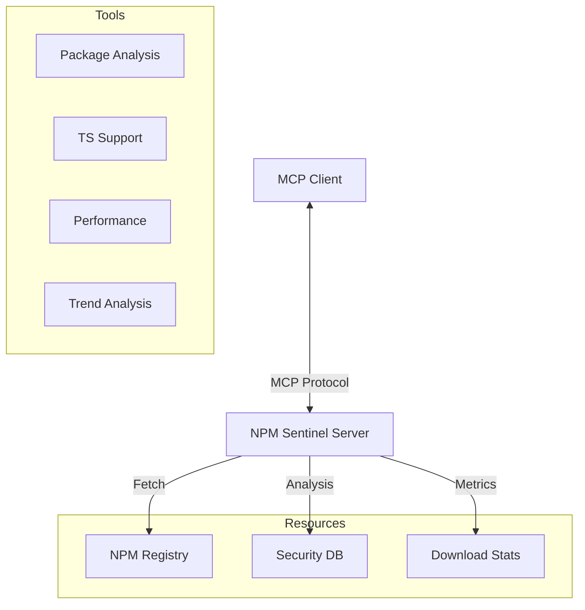

# Directory Structure
```
__tests__/
  handlers/
    cache-invalidation.test.ts
    npm-metrics.test.ts
    npm-registry.test.ts
    npm-security.test.ts
  security/
    validation.test.ts
  utils/
    test-helpers.ts
.github/
  workflows/
    publish.yml
  FUNDING.yml
.gitattributes
.gitignore
.npmignore
.npmrc
.releaserc.json
biome.json
CHANGELOG.md
Dockerfile
index.ts
LICENSE
llms-full.txt
llms.txt
package.json
README.md
SECURITY.md
server.json
smithery.yaml
tsconfig.json
vitest.config.ts
```

# Files

## File: __tests__/handlers/cache-invalidation.test.ts
````typescript
import { beforeEach, describe, expect, test, vi } from 'vitest';
import { handleNpmVersions } from '../../index';
import { validateToolResponse } from '../utils/test-helpers';
````

## File: __tests__/handlers/npm-metrics.test.ts
````typescript
import { beforeEach, describe, expect, test, vi } from 'vitest';
import {
	handleNpmDeps,
	handleNpmMaintenance,
	handleNpmQuality,
	handleNpmRepoStats,
	handleNpmScore,
	handleNpmSize,
} from '../../index';
import { validateToolResponse } from '../utils/test-helpers';
````

## File: __tests__/handlers/npm-registry.test.ts
````typescript
import { beforeEach, describe, expect, test, vi } from 'vitest';
import {
	handleNpmAlternatives,
	handleNpmChangelogAnalysis,
	handleNpmCompare,
	handleNpmDeprecated,
	handleNpmLatest,
	handleNpmMaintainers,
	handleNpmPackageReadme,
	handleNpmSearch,
	handleNpmTrends,
	handleNpmVersions,
} from '../../index';
import { extractTextFromResponse, validateToolResponse } from '../utils/test-helpers';
⋮----
const createMockResponse = (body: any, ok = true, status = 200) =>
⋮----
const createMockErrorResponse = (
	status = 404,
	statusText = 'Not Found',
	errorBody: any = { message: 'Package not found' },
) =>
````

## File: __tests__/handlers/npm-security.test.ts
````typescript
import { beforeEach, describe, expect, test, vi } from 'vitest';
import {
	handleNpmLicenseCompatibility,
	handleNpmTypes,
	handleNpmVulnerabilities,
} from '../../index';
import { validateToolResponse } from '../utils/test-helpers';
````

## File: __tests__/security/validation.test.ts
````typescript
import { describe, expect, test } from 'vitest';
import {
	handleNpmAlternatives,
	handleNpmChangelogAnalysis,
	handleNpmCompare,
	handleNpmDeprecated,
	handleNpmDeps,
	handleNpmLatest,
	handleNpmLicenseCompatibility,
	handleNpmMaintainers,
	handleNpmMaintenance,
	handleNpmPackageReadme,
	handleNpmQuality,
	handleNpmRepoStats,
	handleNpmScore,
	handleNpmSize,
	handleNpmTrends,
	handleNpmVersions,
	handleNpmVulnerabilities,
} from '../../index';
⋮----
const runTest = async (handler: (args: any) => Promise<any>, args: any) =>
````

## File: __tests__/utils/test-helpers.ts
````typescript
import type { CallToolResult, TextContent } from '@modelcontextprotocol/sdk/types.js';
import { expect, vi } from 'vitest';
⋮----
export function extractTextFromResponse(response: CallToolResult): string
⋮----
export function mockFetch(responseData: any =
⋮----
export function mockErrorFetch(status = 404, statusText = 'Not Found')
⋮----
export function validateToolResponse(response: CallToolResult)
````

## File: .github/workflows/publish.yml
````yaml
name: npm-mcp-server
on:
    push:
        branches: [main]
    pull_request:
        branches: [main]
jobs:
    quality:
        runs-on: ${{matrix.os}}
        timeout-minutes: 10
        strategy:
            matrix:
                node-version: [20.9.0, lts/*]
                os: [ubuntu-latest]
        steps:
            - uses: actions/checkout@v4
            - name: Install system dependencies
              run: |
                sudo apt-get update
                sudo apt-get install -y libsecret-1-0
            - name: Use Node.js ${{matrix.node-version}}
              uses: actions/setup-node@v4
              with:
                  node-version: ${{matrix.node-version}}
                  cache: 'npm'
            - run: npm ci
            - name: Handle optional dependencies
              run: |
                npm ci --no-optional
                npm install --optional
            - name: Lint
              run: npm run lint --if-present
            - name: Test
              run: npm run test
            - name: Build STDIO
              run: npm run build:stdio
            - name: Build HTTP
              run: npm run build:http
    publish:
        permissions:
            contents: write
            id-token: write
        runs-on: ubuntu-latest
        timeout-minutes: 15
        if: ${{github.ref == 'refs/heads/main'}}
        needs: [quality]
        steps:
            - uses: actions/checkout@v4
              with:
                fetch-depth: 0
            - name: Install system dependencies
              run: |
                sudo apt-get update
                sudo apt-get install -y libsecret-1-0
            - name: Use Node.js 20.9.0
              uses: actions/setup-node@v4
              with:
                  node-version: '20.9.0'
                  cache: 'npm'
                  registry-url: 'https://registry.npmjs.org'
                  scope: '@nekzus'
            - run: npm ci
            - name: Semantic Release
              run: npm run semantic-release
              env:
                  GH_TOKEN: ${{secrets.GH_TOKEN}}
                  NPM_CONFIG_PROVENANCE: true
            - name: Publish to NPM (Token)
              run: npm publish --provenance --access public
              env:
                NODE_AUTH_TOKEN: ${{ secrets.NPM_TOKEN }}
            - name: Get new version
              id: get_version
              run: |
                NEW_VERSION=$(node -p "require('./package.json').version")
                echo "new_version=$NEW_VERSION" >> $GITHUB_OUTPUT
                echo "📦 New version: $NEW_VERSION"
            - name: Update server.json version and SHA256
              run: |
                VERSION=$(node -p "require('./package.json').version")
                echo "📦 Updating server.json with version: $VERSION"
                sed "s/{{VERSION}}/$VERSION/g" server.json > server.json.tmp
                mv server.json.tmp server.json
                echo "✅ server.json updated successfully"
                echo "📋 Final server.json version:"
                cat server.json | jq '.version, .packages[0].version'
            - name: Build STDIO version for npm package
              run: |
                npm run build:stdio
                rm -rf .smithery/
            - name: Verify npm package contents
              run: |
                echo "=== NPM Package Contents ==="
                ls -la dist/
                echo "=== Excluded Smithery artifacts ==="
                ls -la .smithery/ 2>/dev/null || echo "Smithery artifacts removed successfully"
                echo "=== Version in compiled code ==="
                grep -n "version:" dist/index.js | head -1
            - name: Install MCP Publisher
              run: |
                curl -L "https://github.com/modelcontextprotocol/registry/releases/download/v1.4.0/mcp-publisher_$(uname -s | tr '[:upper:]' '[:lower:]')_$(uname -m | sed 's/x86_64/amd64/;s/aarch64/arm64/').tar.gz" | tar xz mcp-publisher
            - name: Login to MCP Registry
              run: ./mcp-publisher login github-oidc
            - name: Publish to MCP Registry
              run: ./mcp-publisher publish
            - name: Build HTTP version for Smithery
              run: |
                npm run build:http
                echo "=== Smithery build artifacts ==="
                ls -la .smithery/
            - name: Verify Smithery deployment readiness
              run: |
                echo "=== Required files for Smithery deploy ==="
                echo "smithery.yaml:"
                cat smithery.yaml
                echo ""
                echo "package.json module field:"
                node -p "require('./package.json').module"
                echo ""
                echo "Smithery build artifacts:"
                ls -la .smithery/
                echo ""
                echo "✅ Smithery deployment files verified!"
            # Set Dockerfile version label from package.json
            - name: Set Dockerfile version label from package.json
              run: |
                VERSION=$(node -p "require('./package.json').version")
                sed -i "s/LABEL version=\"[^\"]*\"/LABEL version=\"$VERSION\"/" Dockerfile
````

## File: .github/FUNDING.yml
````yaml
ko_fi: nekzus
````

## File: .gitattributes
````
*.ts linguist-language=TypeScript
````

## File: .gitignore
````
# Dependencies
node_modules/
.pnp/
.pnp.js

# Production build
dist/
build/
.smithery/

# Environment variables
.env
.env.local
.env.*.local

# Logs
logs/
*.log
npm-debug.log*
yarn-debug.log*
yarn-error.log*

# Editor directories and files
.idea/
.vscode/
*.suo
*.ntvs*
*.njsproj
*.sln
*.sw?

# TypeScript cache
*.tsbuildinfo

# Optional npm cache directory
.npm

# Optional eslint cache
.eslintcache

# Coverage directory
coverage/

# Mac files
.DS_Store

# Cursor
.cursorrules
memory-bank/
memory.json

# MCP Registry
.mcpregistry*
````

## File: .npmignore
````
# Smithery artifacts (exclude from npm package)
.smithery/
.smithery.yaml

# Development and build artifacts
node_modules/
*.log
*.tsbuildinfo

# IDE and editor files
.vscode/
.idea/
*.swp
*.swo

# OS generated files
.DS_Store
.DS_Store?
._*
.Spotlight-V100
.Trashes
ehthumbs.db
Thumbs.db

# Test coverage
coverage/
.nyc_output/

# Temporary files
*.tmp
*.temp
````

## File: .npmrc
````
save-exact=true
registry="https://registry.npmjs.org/"
````

## File: .releaserc.json
````json
{
  "branches": ["main"],
  "plugins": [
    "@semantic-release/commit-analyzer",
    "@semantic-release/release-notes-generator",
    [
      "@semantic-release/changelog",
      {
        "changelogFile": "CHANGELOG.md",
        "changelogTitle": "# Changelog\n\nAll notable changes to this project will be documented in this file. See\n[Conventional Commits](https://conventionalcommits.org) for commit guidelines."
      }
    ],
    [
      "@semantic-release/npm",
      {
        "npmPublish": false,
        "verifyConditions": false
      }
    ],
    [
      "@semantic-release/git",
      {
        "assets": ["package.json", "CHANGELOG.md"],
        "message": "chore(release): ${nextRelease.version} [skip ci]\n\n${nextRelease.notes}"
      }
    ],
    "@semantic-release/github"
  ]
}
````

## File: biome.json
````json
{
  "$schema": "https://biomejs.dev/schemas/2.4.4/schema.json",
  "vcs": {
    "enabled": true,
    "clientKind": "git",
    "useIgnoreFile": true
  },
  "files": {
    "ignoreUnknown": false
  },
  "formatter": {
    "enabled": true,
    "formatWithErrors": false,
    "indentStyle": "tab",
    "lineEnding": "lf",
    "lineWidth": 100
  },
  "assist": { "actions": { "source": { "organizeImports": "on" } } },
  "linter": {
    "enabled": true,
    "rules": {
      "recommended": true,
      "style": {
        "noNonNullAssertion": "off"
      },
      "suspicious": {
        "noExplicitAny": "off"
      }
    }
  },
  "javascript": {
    "formatter": {
      "quoteStyle": "single"
    }
  },
  "json": {
    "formatter": {
      "indentStyle": "space"
    }
  }
}
````

## File: CHANGELOG.md
````markdown
# Changelog

All notable changes to this project will be documented in this file. See
[Conventional Commits](https://conventionalcommits.org) for commit guidelines.

# [1.18.0](https://github.com/Nekzus/npm-sentinel-mcp/compare/v1.17.0...v1.18.0) (2026-02-22)


### Features

* **1.18.0:** inject transitive topology insights via deps.dev into npmDeps ([a6595c3](https://github.com/Nekzus/npm-sentinel-mcp/commit/a6595c3400fe5e714e6deee9bba912709cbbb840))

# [1.17.0](https://github.com/Nekzus/npm-sentinel-mcp/compare/v1.16.2...v1.17.0) (2026-02-22)


### Features

* **mcp:** integrate deps.dev for massive dependency tree resolution bypassing edge subrequest limits in vulnerability scans ([255d599](https://github.com/Nekzus/npm-sentinel-mcp/commit/255d5991dc3e74941ee336abab4517c9e00bfb2f))

## [1.16.1](https://github.com/Nekzus/npm-sentinel-mcp/compare/v1.16.0...v1.16.1) (2026-02-15)


### Bug Fixes

* **test:** resolve Zod validation errors in npm-registry.test.ts and cleanup obsolete tests ([c3a2eb2](https://github.com/Nekzus/npm-sentinel-mcp/commit/c3a2eb26aea2cce0bb35ecc320a73cb89715f945))

# [1.16.0](https://github.com/Nekzus/npm-sentinel-mcp/compare/v1.15.1...v1.16.0) (2026-01-02)


### Features

* **security:** enforce strict package name validation across all tools ([02c4a88](https://github.com/Nekzus/npm-sentinel-mcp/commit/02c4a889438f841df628d5312009455e41092813))

## [1.15.1](https://github.com/Nekzus/npm-sentinel-mcp/compare/v1.15.0...v1.15.1) (2026-01-02)


### Bug Fixes

* **deps:** downgrade semantic-release-github to v10 for node 20 compatibility ([a86dd4f](https://github.com/Nekzus/npm-sentinel-mcp/commit/a86dd4f49f3cffc9799c9f3d0d9861788679ce4a))
* **deps:** resolve merge conflict using compatible versions for node 20 ([3d2e619](https://github.com/Nekzus/npm-sentinel-mcp/commit/3d2e61929431f1ec04fdd08fafa0735095f5c346))
* **deps:** update semantic-release to resolve peer dependency conflicts ([2affc90](https://github.com/Nekzus/npm-sentinel-mcp/commit/2affc9045e4477614c2e03936901ebdfec41a0ff))
* **security:** remediation of vulnerabilities, input validation and build fix ([39066be](https://github.com/Nekzus/npm-sentinel-mcp/commit/39066be40f370890091bf0cfccabd75e9a886b8f))

# [1.15.0](https://github.com/Nekzus/npm-sentinel-mcp/compare/v1.14.0...v1.15.0) (2025-12-30)


### Features

* implement robust cache invalidation mechanisms ([2966672](https://github.com/Nekzus/npm-sentinel-mcp/commit/2966672720d71d3e24314a388a9de9e393b9bdde))

# [1.14.0](https://github.com/Nekzus/npm-sentinel-mcp/compare/v1.13.3...v1.14.0) (2025-12-24)


### Features

* enhance vulnerability detection with transitive scanning, react ecosystem awareness, and cve enrichment ([fa2b24b](https://github.com/Nekzus/npm-sentinel-mcp/commit/fa2b24b1c882acffad91d097c266c4cc778448cb))
* enhance vulnerability scanning with transitive dependency check and latest version resolution ([01c2ac7](https://github.com/Nekzus/npm-sentinel-mcp/commit/01c2ac7eeb374587a80c981733c40d2d01e4808f))
* enrich vulnerability data with CVE IDs and summaries from OSV API ([670ce68](https://github.com/Nekzus/npm-sentinel-mcp/commit/670ce6847cc0e57b9c3a4390bdf042d36fbfdce9))
* implement ecosystem awareness to scan associated packages (e.g. react-server-dom-webpack) ([16e61e2](https://github.com/Nekzus/npm-sentinel-mcp/commit/16e61e2418df8ca574bc70ac6a878c1b27c7ef18))

## [1.13.3](https://github.com/Nekzus/npm-sentinel-mcp/compare/v1.13.2...v1.13.3) (2025-12-24)


### Bug Fixes

* **smithery:** explicate configSchema at root level for better detection ([cf32f59](https://github.com/Nekzus/npm-sentinel-mcp/commit/cf32f59feed82d999071fb7ae44caf3e6c8e14f9))

## [1.13.2](https://github.com/Nekzus/npm-sentinel-mcp/compare/v1.13.1...v1.13.2) (2025-12-24)


### Bug Fixes

* include smithery.yaml and server.json in npm package files ([2efbde2](https://github.com/Nekzus/npm-sentinel-mcp/commit/2efbde298d6f1d53673213c2714bc65a32b1bf95))

## [1.13.1](https://github.com/Nekzus/npm-sentinel-mcp/compare/v1.13.0...v1.13.1) (2025-12-24)


### Bug Fixes

* **ci:** consolidate npm publish into semantic-release to prevent double-publish errors ([3ecc448](https://github.com/Nekzus/npm-sentinel-mcp/commit/3ecc44845c20569b64f461473e085c3e46648750))


### Reverts

* semantic release changes, restore manual publish step ([c24beca](https://github.com/Nekzus/npm-sentinel-mcp/commit/c24becab7a9ff3ca5d1e56f464e48c2990a51a76))

# [1.13.0](https://github.com/Nekzus/npm-sentinel-mcp/compare/v1.12.36...v1.13.0) (2025-12-24)


### Features

* improve smithery quality score by adding config schema and prompts ([e9e285d](https://github.com/Nekzus/npm-sentinel-mcp/commit/e9e285dcf79c657f3c24b3b440570b85cf1545c9))

## [1.12.36](https://github.com/Nekzus/npm-sentinel-mcp/compare/v1.12.35...v1.12.36) (2025-12-24)


### Bug Fixes

* revert docker improvements (libsecret, tini) as requested ([0c7fe80](https://github.com/Nekzus/npm-sentinel-mcp/commit/0c7fe807f3c3ed571ea93b75edd761c4e5fcf16e))

## [1.12.35](https://github.com/Nekzus/npm-sentinel-mcp/compare/v1.12.34...v1.12.35) (2025-12-24)


### Bug Fixes

* bump to 1.12.35 to include production docker improvements (libsecret, tini) ([9e020e5](https://github.com/Nekzus/npm-sentinel-mcp/commit/9e020e55a8cbe6057b11f8636111d4a79919fb03))

## [1.12.34](https://github.com/Nekzus/npm-sentinel-mcp/compare/v1.12.33...v1.12.34) (2025-12-24)


### Bug Fixes

* update README badges and finalize configuration for release ([058c218](https://github.com/Nekzus/npm-sentinel-mcp/commit/058c218496500691aaa8365d52d9234c99fbcd9b))

## [1.12.33](https://github.com/Nekzus/npm-sentinel-mcp/compare/v1.12.32...v1.12.33) (2025-12-24)


### Bug Fixes

* **registry:** update server.json identifier to match renamed npm package @nekzus/mcp-server ([5de23e9](https://github.com/Nekzus/npm-sentinel-mcp/commit/5de23e943290a84d955d10dfbbedd0ba32432931))

## [1.12.32](https://github.com/Nekzus/npm-sentinel-mcp/compare/v1.12.31...v1.12.32) (2025-12-24)


### Bug Fixes

* **ci:** restore NPM_TOKEN auth for publishing, requiring Automation token to bypass 2FA ([142bb4c](https://github.com/Nekzus/npm-sentinel-mcp/commit/142bb4c13b8d0fba56e8a1449da7da9d8c3ead2e))

## [1.12.31](https://github.com/Nekzus/npm-sentinel-mcp/compare/v1.12.30...v1.12.31) (2025-12-24)


### Bug Fixes

* **ci:** configure tokenless OIDC publishing by removing setup-node registry setup ([1017ce6](https://github.com/Nekzus/npm-sentinel-mcp/commit/1017ce6325c8f8be183d7157c87cb98a9e329c2a))

## [1.12.30](https://github.com/Nekzus/npm-sentinel-mcp/compare/v1.12.29...v1.12.30) (2025-12-24)


### Bug Fixes

* **ci:** switch to OIDC for npm publishing to bypass 2FA restrictions on automation tokens ([17bbe48](https://github.com/Nekzus/npm-sentinel-mcp/commit/17bbe48eac1ae45a8d58047448fb5b31a6b18f75))
* **config:** revert version to 1.11.8 and mcpName to io.github.Nekzus/npm-sentinel-mcp as requested ([a63038b](https://github.com/Nekzus/npm-sentinel-mcp/commit/a63038b134adcf3a695d7739efa872edd8fd3089))

## [1.12.29](https://github.com/Nekzus/npm-sentinel-mcp/compare/v1.12.28...v1.12.29) (2025-12-24)


### Bug Fixes

* **config:** rename package to @nekzus/mcp-server and update mcp identifier ([9ef2c7f](https://github.com/Nekzus/npm-sentinel-mcp/commit/9ef2c7f13cef870ca135631fba72b2db79f73e70))

## [1.12.28](https://github.com/Nekzus/npm-sentinel-mcp/compare/v1.12.27...v1.12.28) (2025-12-24)


### Bug Fixes

* **deploy:** skip prepare script during npm install to avoid missing source error, but rebuild native modules ([e1aacb8](https://github.com/Nekzus/npm-sentinel-mcp/commit/e1aacb8561c62b29d8c8f91679dfe49277c3b333))

## [1.12.27](https://github.com/Nekzus/npm-sentinel-mcp/compare/v1.12.26...v1.12.27) (2025-12-24)


### Bug Fixes

* **deploy:** fix Alpine Dockerfile - install build tools and allow scripts for keytar compilation ([590b3df](https://github.com/Nekzus/npm-sentinel-mcp/commit/590b3dfede9cc58764c16ab6a82de4ca63f4fe16))

## [1.12.26](https://github.com/Nekzus/npm-sentinel-mcp/compare/v1.12.25...v1.12.26) (2025-12-24)


### Bug Fixes

* **deploy:** update Dockerfile with smithery-generated multi-stage alpine build ([78a2569](https://github.com/Nekzus/npm-sentinel-mcp/commit/78a256920b98cb83062c91256e3e7d71bd3aab3b))

## [1.12.25](https://github.com/Nekzus/npm-sentinel-mcp/compare/v1.12.24...v1.12.25) (2025-12-24)


### Bug Fixes

* **deploy:** enable native module compilation in Dockerfile (install build-essential, remove ignore-scripts) ([2d3cb0b](https://github.com/Nekzus/npm-sentinel-mcp/commit/2d3cb0b8aae6e9e3b7efe4a1d418c376cd179457))

## [1.12.24](https://github.com/Nekzus/npm-sentinel-mcp/compare/v1.12.23...v1.12.24) (2025-12-24)


### Bug Fixes

* **deploy:** update smithery.yaml startCommand type to "http" for cloud deployment ([de77c70](https://github.com/Nekzus/npm-sentinel-mcp/commit/de77c7008677b8309cec78b363a9bcf91d9a07c0))

## [1.12.23](https://github.com/Nekzus/npm-sentinel-mcp/compare/v1.12.22...v1.12.23) (2025-12-24)


### Bug Fixes

* **deploy:** switch smithery.yaml to container runtime to force usage of custom Dockerfile ([3e2c689](https://github.com/Nekzus/npm-sentinel-mcp/commit/3e2c6895f1c50ed5ea4a9beeee7f2a8d784a9fe2))

## [1.12.22](https://github.com/Nekzus/npm-sentinel-mcp/compare/v1.12.21...v1.12.22) (2025-12-24)


### Bug Fixes

* **deploy:** use custom Dockerfile to install libsecret-1-0 and bypass smithery auto-build limitations ([93acecd](https://github.com/Nekzus/npm-sentinel-mcp/commit/93acecd3be7ca96d18962eb6f1ececec1a77f040))
* manual trigger for final deployment verification ([19c9b71](https://github.com/Nekzus/npm-sentinel-mcp/commit/19c9b7157fb4fdc1d8c79a3214548c0c34da62cd))

## [1.12.21](https://github.com/Nekzus/npm-sentinel-mcp/compare/v1.12.20...v1.12.21) (2025-12-24)


### Bug Fixes

* **config:** update server.json schema to 2025-12-11 to support registryType property ([6b7e1d6](https://github.com/Nekzus/npm-sentinel-mcp/commit/6b7e1d6f8e07136aa3c6f5fb1cf8a13ea56a548c))

## [1.12.20](https://github.com/Nekzus/npm-sentinel-mcp/compare/v1.12.19...v1.12.20) (2025-12-24)


### Bug Fixes

* **ci:** correct mcp-publisher v1.4.0 download url format (remove version from filename) ([8360dee](https://github.com/Nekzus/npm-sentinel-mcp/commit/8360deeab069406c0cb6866aa5abb39865dab436))

## [1.12.19](https://github.com/Nekzus/npm-sentinel-mcp/compare/v1.12.18...v1.12.19) (2025-12-24)


### Bug Fixes

* **ci:** restore missing step name in publish.yml to fix YAML syntax error ([7155ab1](https://github.com/Nekzus/npm-sentinel-mcp/commit/7155ab1bff8524e387e82ff456a4ef732792d26c))
* **ci:** upgrade mcp-publisher to v1.4.0 to resolve registryType serialization bug ([5b01fc0](https://github.com/Nekzus/npm-sentinel-mcp/commit/5b01fc07226e35dcd8b4f27e697ac31de0f003a6))

## [1.12.18](https://github.com/Nekzus/npm-sentinel-mcp/compare/v1.12.17...v1.12.18) (2025-12-24)


### Bug Fixes

* **deploy:** configure custom buildCommand in smithery.yaml to match established pipeline ([6d1a975](https://github.com/Nekzus/npm-sentinel-mcp/commit/6d1a97593f92e6e9c801cf1da773a8bb47554c32))

## [1.12.17](https://github.com/Nekzus/npm-sentinel-mcp/compare/v1.12.16...v1.12.17) (2025-12-24)


### Bug Fixes

* manual trigger for deployment verification ([becad23](https://github.com/Nekzus/npm-sentinel-mcp/commit/becad2335188a0e4cb499be1b09346514833ac82))

## [1.12.16](https://github.com/Nekzus/npm-sentinel-mcp/compare/v1.12.15...v1.12.16) (2025-12-24)


### Bug Fixes

* **registry:** revert to registryType to match live API requirements ([ec8ca1c](https://github.com/Nekzus/npm-sentinel-mcp/commit/ec8ca1c6cf516755816d649d7c9790542c24915b))

## [1.12.15](https://github.com/Nekzus/npm-sentinel-mcp/compare/v1.12.14...v1.12.15) (2025-12-24)


### Bug Fixes

* **registry:** use registry_type in server.json and enable mcp publishing ([a818310](https://github.com/Nekzus/npm-sentinel-mcp/commit/a81831055a60a32a680ee52d04765f7edb807e7c))

## [1.12.14](https://github.com/Nekzus/npm-sentinel-mcp/compare/v1.12.13...v1.12.14) (2025-12-24)


### Bug Fixes

* **ci:** prevent deletion of smithery dependencies before build step ([30542f2](https://github.com/Nekzus/npm-sentinel-mcp/commit/30542f2c88976e8e8ef1786353ae168b6976d338))

## [1.12.13](https://github.com/Nekzus/npm-sentinel-mcp/compare/v1.12.12...v1.12.13) (2025-12-24)


### Bug Fixes

* **build:** invoke smithery cli via node with direct path to bypass symlink issues ([10af258](https://github.com/Nekzus/npm-sentinel-mcp/commit/10af25810088151841a8a0c123a2cedf0c300c4b))

## [1.12.12](https://github.com/Nekzus/npm-sentinel-mcp/compare/v1.12.11...v1.12.12) (2025-12-24)


### Bug Fixes

* **build:** use explicit path for smithery binary to resolve CI PATH issues ([ab940ea](https://github.com/Nekzus/npm-sentinel-mcp/commit/ab940eaa48bb8ffab70cd9882218d01aaa3564fa))

## [1.12.11](https://github.com/Nekzus/npm-sentinel-mcp/compare/v1.12.10...v1.12.11) (2025-12-24)


### Bug Fixes

* **build:** use local smithery binary to ensure dependency resolution ([3d387a6](https://github.com/Nekzus/npm-sentinel-mcp/commit/3d387a6f92edc38bc0bb3a3db3be6ba8c675c7e4))

## [1.12.10](https://github.com/Nekzus/npm-sentinel-mcp/compare/v1.12.9...v1.12.10) (2025-12-24)


### Bug Fixes

* **build:** update @smithery/cli to ^2.0.0 to match npx runtime and fix resolution ([8aa44e3](https://github.com/Nekzus/npm-sentinel-mcp/commit/8aa44e3b984436c0a761e4cad81ff63c5219d8ef))

## [1.12.9](https://github.com/Nekzus/npm-sentinel-mcp/compare/v1.12.8...v1.12.9) (2025-12-24)


### Bug Fixes

* **build:** add missing @smithery/sdk dependency for build:http ([08452b1](https://github.com/Nekzus/npm-sentinel-mcp/commit/08452b1d64ff88153937b65baaf759a80ee7d536))

## [1.12.8](https://github.com/Nekzus/npm-sentinel-mcp/compare/v1.12.7...v1.12.8) (2025-12-24)


### Bug Fixes

* **ci:** install libsecret-1-0 for smithery/cli build ([1f49553](https://github.com/Nekzus/npm-sentinel-mcp/commit/1f49553e7dd7044111ce47e527580ca1ecc5f257))

## [1.12.7](https://github.com/Nekzus/npm-sentinel-mcp/compare/v1.12.6...v1.12.7) (2025-12-24)


### Bug Fixes

* **ci:** disable MCP Registry publish due to CLI v1.0.0 schema bug ([fb29da6](https://github.com/Nekzus/npm-sentinel-mcp/commit/fb29da6c6e7fe4144372a300a8df8b407b6b7877))

## [1.12.6](https://github.com/Nekzus/npm-sentinel-mcp/compare/v1.12.5...v1.12.6) (2025-12-24)


### Bug Fixes

* **registry:** correct server.json schema to match API requirements ([d5ac3c2](https://github.com/Nekzus/npm-sentinel-mcp/commit/d5ac3c2a9e0b250d408c7e52ac4f521e61f33da1))

## [1.12.5](https://github.com/Nekzus/npm-sentinel-mcp/compare/v1.12.4...v1.12.5) (2025-12-24)


### Bug Fixes

* **ci:** use NPM_TOKEN for initial package bootstrap ([a4dcc69](https://github.com/Nekzus/npm-sentinel-mcp/commit/a4dcc6911bccb657546938aa50f5ef6832d57c38))

## [1.12.4](https://github.com/Nekzus/npm-sentinel-mcp/compare/v1.12.3...v1.12.4) (2025-12-24)


### Bug Fixes

* rename package to @nekzus/npm-sentinel-mcp to match repo and OIDC config ([54a2122](https://github.com/Nekzus/npm-sentinel-mcp/commit/54a2122e7450e3f1118624ac161b4265ee9166df))

## [1.12.3](https://github.com/Nekzus/npm-sentinel-mcp/compare/v1.12.2...v1.12.3) (2025-12-24)


### Bug Fixes

* **ci:** add scope to setup-node to ensure correct .npmrc for [@nekzus](https://github.com/nekzus) ([08785fc](https://github.com/Nekzus/npm-sentinel-mcp/commit/08785fc59bc0d2107b89286befa0cbb91314bf30))

## [1.12.2](https://github.com/Nekzus/npm-sentinel-mcp/compare/v1.12.1...v1.12.2) (2025-12-24)


### Bug Fixes

* **ci:** restore .npmrc and add dummy token to enable OIDC override ([f1e7ed9](https://github.com/Nekzus/npm-sentinel-mcp/commit/f1e7ed97f83143bbd6e1f685075cea9445a37144))

## [1.12.1](https://github.com/Nekzus/npm-sentinel-mcp/compare/v1.12.0...v1.12.1) (2025-12-24)


### Bug Fixes

* **ci:** remove .npmrc before manual publish to ensure OIDC auth ([e31d6a0](https://github.com/Nekzus/npm-sentinel-mcp/commit/e31d6a0269f90a954fd97752ef55722d23b2ae65))

# [1.12.0](https://github.com/Nekzus/npm-sentinel-mcp/compare/v1.11.8...v1.12.0) (2025-12-24)


### Bug Fixes

* **ci:** disable semantic-release npm publish and use manual OIDC publish ([531bda6](https://github.com/Nekzus/npm-sentinel-mcp/commit/531bda60fcd7f0a1e9ce2b746ea559b81ebca683))
* **ci:** regenerate package-lock.json with legacy-peer-deps validation ([46754c0](https://github.com/Nekzus/npm-sentinel-mcp/commit/46754c0804c76c7dbaf177e5f4bfc6650025df8f))
* **ci:** remove NPM_TOKEN env var to enable OIDC auth for semantic-release ([8c6d365](https://github.com/Nekzus/npm-sentinel-mcp/commit/8c6d3656b777f3168c82106d211a8a89aaf42241))
* **ci:** remove registry-url from setup-node to prevent auth conflicts ([294777e](https://github.com/Nekzus/npm-sentinel-mcp/commit/294777e8e001b0526c262e8ff3e54c7b8e0c13ea))
* **ci:** sync package-lock.json with version bump ([95ec6a3](https://github.com/Nekzus/npm-sentinel-mcp/commit/95ec6a30e10b0a3427f077149acd730eca5e4be5))
* **deps:** add overrides for zod to resolve peer dependency conflicts in CI ([23f1e3c](https://github.com/Nekzus/npm-sentinel-mcp/commit/23f1e3cff1c15b2203b41d6fd5bc304d533b60a3))
* resolve deprecation warnings, standardise registerTool, fix TS errors in tests, bump to 1.12.0 ([c910120](https://github.com/Nekzus/npm-sentinel-mcp/commit/c9101206c46f8c6f70ec70be0f121c353115ec5a))
* **test:** remove useless else block in npm-metrics.test.ts ([77cb102](https://github.com/Nekzus/npm-sentinel-mcp/commit/77cb102398594767767f2b52ee303594e0a725a2))
* **tests:** downgrade zod-to-json-schema and update security mocks/assertions ([6f73522](https://github.com/Nekzus/npm-sentinel-mcp/commit/6f7352219d66cff48fe22958e234aa9b9617d3b4))
* update .gitignore to include memory.json and MCP Registry files; remove obsolete test files ([102fc69](https://github.com/Nekzus/npm-sentinel-mcp/commit/102fc69697164e90c3d492f461896d52c3732890))


### Features

* **npm-sentinel:** modernize vulnerability scanner with batch queries and dependency support ([2be32ce](https://github.com/Nekzus/npm-sentinel-mcp/commit/2be32cedfc05bcfce034e009dc27ce6697d34966))

## [1.11.8](https://github.com/Nekzus/npm-sentinel-mcp/compare/v1.11.7...v1.11.8) (2025-09-20)


### Bug Fixes

* update hardcoded version in index.ts to 1.11.8 ([c5f185e](https://github.com/Nekzus/npm-sentinel-mcp/commit/c5f185e17ecfa50ce5139a2f4bebda8f39570a41))

## [1.11.7](https://github.com/Nekzus/npm-sentinel-mcp/compare/v1.11.6...v1.11.7) (2025-09-20)


### Bug Fixes

* restore {{VERSION}} placeholders in server.json and simplify workflow like example ([22fbd89](https://github.com/Nekzus/npm-sentinel-mcp/commit/22fbd89f183ffd991033a4a176ee22e3ef51e6d3))

## [1.11.6](https://github.com/Nekzus/npm-sentinel-mcp/compare/v1.11.5...v1.11.6) (2025-09-20)


### Bug Fixes

* hardcode version in index.ts and simplify workflow to only update server.json ([e635c91](https://github.com/Nekzus/npm-sentinel-mcp/commit/e635c915127d2bb8bbe16f8fcb95c1c28828259e))

## [1.11.5](https://github.com/Nekzus/npm-sentinel-mcp/compare/v1.11.4...v1.11.5) (2025-09-20)


### Bug Fixes

* add commit step to persist version updates in workflow ([22d5c41](https://github.com/Nekzus/npm-sentinel-mcp/commit/22d5c414ca36c2d7b17a1b8d7ebfa4f841d63025))

## [1.11.4](https://github.com/Nekzus/npm-sentinel-mcp/compare/v1.11.3...v1.11.4) (2025-09-20)


### Bug Fixes

* improve version replacement logic in workflow with better error handling and validation ([85aad9b](https://github.com/Nekzus/npm-sentinel-mcp/commit/85aad9b9463bb3ed97022e082261a782caf85cf2))

## [1.11.3](https://github.com/Nekzus/npm-sentinel-mcp/compare/v1.11.2...v1.11.3) (2025-09-20)


### Bug Fixes

* use temp file method for index.ts template processing ([04d802a](https://github.com/Nekzus/npm-sentinel-mcp/commit/04d802a70316de8f1ae4d7a343e6f008b4bdbf44))

## [1.11.2](https://github.com/Nekzus/npm-sentinel-mcp/compare/v1.11.1...v1.11.2) (2025-09-20)


### Bug Fixes

* implement consistent version handling with templates ([3181d45](https://github.com/Nekzus/npm-sentinel-mcp/commit/3181d45af0a3dad186ae5379bce52fde702231d3))

## [1.11.1](https://github.com/Nekzus/npm-sentinel-mcp/compare/v1.11.0...v1.11.1) (2025-09-20)


### Bug Fixes

* sync hardcoded version in index.ts with package.json ([606654e](https://github.com/Nekzus/npm-sentinel-mcp/commit/606654e8c84821338f1624bc40d2bd56d9c05382))

# [1.11.0](https://github.com/Nekzus/npm-sentinel-mcp/compare/v1.10.1...v1.11.0) (2025-09-20)


### Bug Fixes

* test complete workflow with MCP Registry enabled ([99f9564](https://github.com/Nekzus/npm-sentinel-mcp/commit/99f956467d4a74111912b1aef0df43114f747446))


### Features

* re-enable MCP Registry publishing ([0560354](https://github.com/Nekzus/npm-sentinel-mcp/commit/0560354ba719e5b0fa32c79c8757f46c872daa02))

## [1.10.1](https://github.com/Nekzus/npm-sentinel-mcp/compare/v1.10.0...v1.10.1) (2025-09-20)


### Bug Fixes

* disable MCP Registry publishing temporarily ([69a0abf](https://github.com/Nekzus/npm-sentinel-mcp/commit/69a0abf172ed490a95b7f0e3bfe400d8c9a38e95))
* restore {{VERSION}} templates in server.json and index.ts ([173b33f](https://github.com/Nekzus/npm-sentinel-mcp/commit/173b33f366a995cfd175e663e630473c632d7f27))
* test deployment with corrected workflow ([904ae66](https://github.com/Nekzus/npm-sentinel-mcp/commit/904ae66fd51cffc6e1747e78e018a18b4cf1639b))

# [1.10.0](https://github.com/Nekzus/npm-sentinel-mcp/compare/v1.9.1...v1.10.0) (2025-09-20)


### Features

* add version bump test ([1f4c3d6](https://github.com/Nekzus/npm-sentinel-mcp/commit/1f4c3d6ef8543506cf97a6d0fa96bf21679e08f3))

## [1.9.1](https://github.com/Nekzus/npm-sentinel-mcp/compare/v1.9.0...v1.9.1) (2025-09-20)


### Bug Fixes

* reorder workflow to process templates before building ([7402840](https://github.com/Nekzus/npm-sentinel-mcp/commit/7402840640f2e53505375d2fd1dd744d02da34e5))
* use node: protocol for Node.js imports in process-templates.js ([f78aaf5](https://github.com/Nekzus/npm-sentinel-mcp/commit/f78aaf5ccb5f9970debc6cdc23387ebea6cb283d))

# [1.9.0](https://github.com/Nekzus/npm-sentinel-mcp/compare/v1.8.1...v1.9.0) (2025-09-20)


### Features

* implement automatic version synchronization with templates ([f81b436](https://github.com/Nekzus/npm-sentinel-mcp/commit/f81b436a412aa3a3fd34c05b3da6fb1d939fe170))

## [1.8.1](https://github.com/Nekzus/npm-sentinel-mcp/compare/v1.8.0...v1.8.1) (2025-08-26)


### Bug Fixes

* synchronize version numbers across all files ([0090aeb](https://github.com/Nekzus/npm-sentinel-mcp/commit/0090aeb4f108e4653b62b2fa0210ed05f027719b))

# [1.8.0](https://github.com/Nekzus/npm-sentinel-mcp/compare/v1.7.9...v1.8.0) (2025-08-26)


### Bug Fixes

* resolve Rollup optional dependencies issue in GitHub Actions ([05aa882](https://github.com/Nekzus/npm-sentinel-mcp/commit/05aa8828f444bb6b1ffeec0fed7586a6e75719c9))


### Features

* migrate to HTTP streamable transport with Smithery CLI ([9840217](https://github.com/Nekzus/npm-sentinel-mcp/commit/9840217edb46cb0955d02063f2f8731d9107e43a))

## [1.7.9](https://github.com/Nekzus/npm-sentinel-mcp/compare/v1.7.8...v1.7.9) (2025-06-29)


### Bug Fixes

* Updated Dockerfile ([31695b4](https://github.com/Nekzus/npm-sentinel-mcp/commit/31695b4b023c14bcf28b0199d3e59be95e7ebaae))

## [1.7.8](https://github.com/Nekzus/npm-sentinel-mcp/compare/v1.7.7...v1.7.8) (2025-06-04)


### Bug Fixes

* bump version to 1.7.8 ([096ba89](https://github.com/Nekzus/npm-sentinel-mcp/commit/096ba89502d5df98ddb3d53a605416ec508621e0))

## [1.7.7](https://github.com/Nekzus/npm-sentinel-mcp/compare/v1.7.6...v1.7.7) (2025-06-04)


### Bug Fixes

* Updates ([850e492](https://github.com/Nekzus/npm-sentinel-mcp/commit/850e492dca3203300560a05425619000982f1fe2))

## [1.7.6](https://github.com/Nekzus/npm-sentinel-mcp/compare/v1.7.5...v1.7.6) (2025-05-17)


### Bug Fixes

* Updates ([78e67b4](https://github.com/Nekzus/npm-sentinel-mcp/commit/78e67b4d9bb611ec31afa4e4e580d8716314e20a))

## [1.7.5](https://github.com/Nekzus/npm-sentinel-mcp/compare/v1.7.4...v1.7.5) (2025-05-16)


### Bug Fixes

* update README.md to remove unnecessary badge ([256b474](https://github.com/Nekzus/npm-sentinel-mcp/commit/256b474bbb3808f1fb24f2d8ef5d878d30f3f3ba))

## [1.7.4](https://github.com/Nekzus/npm-sentinel-mcp/compare/v1.7.3...v1.7.4) (2025-05-14)


### Bug Fixes

*  Removed the `getServerStatus` tool ([0399ed1](https://github.com/Nekzus/npm-sentinel-mcp/commit/0399ed1bfc64384212fc48cfedcc8124dc68c37a))

## [1.7.3](https://github.com/Nekzus/npm-sentinel-mcp/compare/v1.7.2...v1.7.3) (2025-05-13)


### Bug Fixes

* 1.7.3 [skip ci] ([3b67c46](https://github.com/Nekzus/npm-sentinel-mcp/commit/3b67c4692a84704cdaf50b5e466f65f133666860))
* update README.md to include server resources ([f71e01b](https://github.com/Nekzus/npm-sentinel-mcp/commit/f71e01bab64e8dd35d8d75365650b65f7271665a))

## [1.7.2](https://github.com/Nekzus/npm-sentinel-mcp/compare/v1.7.1...v1.7.2) (2025-05-13)


### Bug Fixes

* enhance tool definitions in index.ts ([01750a6](https://github.com/Nekzus/npm-sentinel-mcp/commit/01750a6db34a4df3f3cc88beebf05d494cedfb63))

## [1.7.1](https://github.com/Nekzus/npm-sentinel-mcp/compare/v1.7.0...v1.7.1) (2025-05-13)


### Bug Fixes

* bump version to 1.6.1 ([5851952](https://github.com/Nekzus/npm-sentinel-mcp/commit/5851952da0dae85cbbe7563ec6f36779f400c8fa))
* update version to 1.7.1 and adjust file paths ([6c003ee](https://github.com/Nekzus/npm-sentinel-mcp/commit/6c003eece4ec4820d246c437d6649a5b938bff2f))

# [1.7.0](https://github.com/Nekzus/npm-sentinel-mcp/compare/v1.6.1...v1.7.0) (2025-05-11)


### Features

* add resource registration for server documentation ([f69535f](https://github.com/Nekzus/npm-sentinel-mcp/commit/f69535f3fbf5a951c83261e652f16649cd4f6391))
* bump version to 1.7.0 ([584ae29](https://github.com/Nekzus/npm-sentinel-mcp/commit/584ae29e5ca2cd99abe0d32dc827f77875e69d91))

## [1.6.1](https://github.com/Nekzus/npm-sentinel-mcp/compare/v1.6.0...v1.6.1) (2025-05-11)


### Bug Fixes

* improve code readability and consistency in index.ts ([d8eb2b8](https://github.com/Nekzus/npm-sentinel-mcp/commit/d8eb2b8c6f5de85e6a27ffbd4d897aad50d2774e))

# [1.6.0](https://github.com/Nekzus/npm-sentinel-mcp/compare/v1.5.6...v1.6.0) (2025-05-11)


### Bug Fixes

* improve debug messages in isValidNpmsResponse function ([fc75624](https://github.com/Nekzus/npm-sentinel-mcp/commit/fc7562413e790597a5da3c5b7b5a5b5db05c0ffd))


### Features

* add caching support for npm version retrieval ([c9e51bb](https://github.com/Nekzus/npm-sentinel-mcp/commit/c9e51bb5f4dacfbdfb5e88c11ac86846532dbdc1))
* enhance caching logic in handleNpmAlternatives function ([489a99b](https://github.com/Nekzus/npm-sentinel-mcp/commit/489a99b7a0e39e9109e8fd236dd6f25ad507ab85))
* enhance caching logic in handleNpmChangelogAnalysis function ([41e91e6](https://github.com/Nekzus/npm-sentinel-mcp/commit/41e91e6cab9203d2bf7a4c57e6d06daf9525986f))
* enhance caching logic in handleNpmCompare function ([2a0435f](https://github.com/Nekzus/npm-sentinel-mcp/commit/2a0435fdfbc401f5f6e07a9dc5678b3b576ccda8))
* enhance caching logic in handleNpmDeprecated function ([2a46038](https://github.com/Nekzus/npm-sentinel-mcp/commit/2a46038ebfb229b45cf5c6dd5025d350c1da3667))
* enhance caching logic in handleNpmDeps function ([492b266](https://github.com/Nekzus/npm-sentinel-mcp/commit/492b266ca5159cf29075c4d7d77ace9d0ebd8822))
* enhance caching logic in handleNpmLicenseCompatibility function ([7ef0b99](https://github.com/Nekzus/npm-sentinel-mcp/commit/7ef0b99feda96bbff4d52547dc2aa690f2515da4))
* enhance caching logic in handleNpmMaintainers function ([0c83709](https://github.com/Nekzus/npm-sentinel-mcp/commit/0c837091218d8318557f8cf448f08f234fe33ceb))
* enhance caching logic in handleNpmMaintenance function ([f9a53d1](https://github.com/Nekzus/npm-sentinel-mcp/commit/f9a53d162596060b9e7e0bbe0033855bc900651e))
* enhance caching logic in handleNpmPackageReadme function ([93ad407](https://github.com/Nekzus/npm-sentinel-mcp/commit/93ad407153aba48c092eeab7f70b0f053e7f8bea))
* enhance caching logic in handleNpmQuality and handleNpmMaintenance functions ([2317189](https://github.com/Nekzus/npm-sentinel-mcp/commit/2317189b4f5bfcac62f198f2965a64cba950db0a))
* enhance caching logic in handleNpmQuality function ([b6f9fe9](https://github.com/Nekzus/npm-sentinel-mcp/commit/b6f9fe973f49494b39a881e8a8fff950f17dd764))
* enhance caching logic in handleNpmRepoStats function ([0cf4dcf](https://github.com/Nekzus/npm-sentinel-mcp/commit/0cf4dcf1541ebb2ef342dc6ff8fd31b59ec76c6d))
* enhance caching logic in handleNpmScore function ([17e56bc](https://github.com/Nekzus/npm-sentinel-mcp/commit/17e56bcd829402bae6ba7fc3b460329e3b057ef8))
* enhance caching logic in handleNpmSearch function ([8245fcf](https://github.com/Nekzus/npm-sentinel-mcp/commit/8245fcf077243d187f2f5da0023b2efc1cee1394))
* enhance caching logic in handleNpmSize function ([7af7871](https://github.com/Nekzus/npm-sentinel-mcp/commit/7af78716ae7380f308075b503634c5598a8f2171))
* enhance caching logic in handleNpmTypes function ([9ce4f53](https://github.com/Nekzus/npm-sentinel-mcp/commit/9ce4f53996460208131bed1ae6548e96eebacb68))
* enhance caching logic in handleNpmVulnerabilities function ([1c30d56](https://github.com/Nekzus/npm-sentinel-mcp/commit/1c30d5697a4109d517597cbd030109d1de7888ef))
* implement caching mechanism for npm version retrieval ([29f9808](https://github.com/Nekzus/npm-sentinel-mcp/commit/29f9808eddee30416db6681e9a85cebabc677645))
* improve error handling and response formatting in handleNpm functions ([5b10ccd](https://github.com/Nekzus/npm-sentinel-mcp/commit/5b10ccdfda0a4853ee52040c96efcfec8c9a1675))
* update README to reflect new features and API response format ([077ab2a](https://github.com/Nekzus/npm-sentinel-mcp/commit/077ab2acf104c41b30ee0222fe7148f4bb62d165))

## [1.5.6](https://github.com/Nekzus/npm-sentinel-mcp/compare/v1.5.5...v1.5.6) (2025-04-24)


### Bug Fixes

* add semantic-release configuration and CHANGELOG file for automated versioning and release notes generation ([2c35197](https://github.com/Nekzus/npm-sentinel-mcp/commit/2c35197d6f4aa3007bdcb89f1bf032f282a94963))

## [1.5.5](https://github.com/Nekzus/npm-sentinel-mcp/compare/v1.5.4...v1.5.5) (2025-04-22)


### Bug Fixes

* add NODE_AUTH_TOKEN to publish workflow for improved NPM authentication during releases ([e857491](https://github.com/Nekzus/npm-sentinel-mcp/commit/e85749114e89c5c43f39eabb23a7f4dc5639776d))
* update README.md to enhance project description and improve badge formatting for the npm-mcp-server ([d8a1c66](https://github.com/Nekzus/npm-sentinel-mcp/commit/d8a1c667cfac5da7560588d8947af36c3ffb8b66))


## [1.5.4](https://github.com/Nekzus/npm-sentinel-mcp/compare/v1.5.3...v1.5.4) (2025-04-20)


### Bug Fixes

* enhance index.ts and llms documentation with detailed descriptions for NPM tools and Docker configuration ([c8387e7](https://github.com/Nekzus/npm-sentinel-mcp/commit/c8387e749e2c571cadb0f9e0961530dd1cc21203))


## [1.5.3](https://github.com/Nekzus/npm-sentinel-mcp/compare/v1.5.2...v1.5.3) (2025-04-18)


### Bug Fixes

* update @modelcontextprotocol/sdk dependency to version 1.10.1 in package.json and package-lock.json for improved functionality ([e853bb5](https://github.com/Nekzus/npm-sentinel-mcp/commit/e853bb589c325266b5d3c27db38c0eaa22ac0aa2))


## [1.5.2](https://github.com/Nekzus/npm-sentinel-mcp/compare/v1.5.1...v1.5.2) (2025-04-18)


### Bug Fixes

* update package.json and package-lock.json to upgrade @modelcontextprotocol/sdk to version 1.10.0; remove outdated express dependency and related types for cleaner dependency management ([6e6b3fd](https://github.com/Nekzus/npm-sentinel-mcp/commit/6e6b3fd958bc90a9f50a54a73b7d1e3bd0c3e324))


## [1.5.1](https://github.com/Nekzus/npm-sentinel-mcp/compare/v1.5.0...v1.5.1) (2025-04-18)


### Bug Fixes

* update package-lock.json to remove unnecessary biomejs CLI packages and clean up dependencies; modify README.md to enhance project description and features; update package.json to ensure proper formatting ([38f6dda](https://github.com/Nekzus/npm-sentinel-mcp/commit/38f6ddad0216dde7f580456a696ed36f0d505e64))


# [1.5.0](https://github.com/Nekzus/npm-sentinel-mcp/compare/v1.4.2...v1.5.0) (2025-04-18)


### Bug Fixes

* add maintainers support to NPM package schema in index.ts; enhance isNpmPackageInfo type guard for maintainers validation; improve error handling in handleNpmMaintainers function for better API response management; update README.md to reflect new features and installation instructions ([c45595a](https://github.com/Nekzus/npm-sentinel-mcp/commit/c45595ae8eafd7b1cecb7f718cb62a034810cd22))


### Features

* add new NPM tools for maintainers, score, README retrieval, and search functionality in index.ts; implement validation and error handling for API responses; enhance NpmsApiResponse interface and Zod schemas for improved data structure and type safety ([16acc12](https://github.com/Nekzus/npm-sentinel-mcp/commit/16acc123871dbd5dd39730cbc5e14d48300a2553))
* enhance NPM tools in index.ts by adding support for multiple package inputs across various functionalities; update parameter validation and error handling for improved robustness; implement changelog analysis and deprecation checks for better package management insights ([6358191](https://github.com/Nekzus/npm-sentinel-mcp/commit/63581915f737f98d75d0149fb99d9e100ad3dcdd))
* implement npmRepoStats tool in index.ts to analyze GitHub repository statistics; enhance error handling and validation for API responses; update license compatibility analysis for improved data structure and type safety ([a20e3e2](https://github.com/Nekzus/npm-sentinel-mcp/commit/a20e3e22118aa8b5b298cb2a92359f72519398a8))


## [1.4.2](https://github.com/Nekzus/npm-sentinel-mcp/compare/v1.4.1...v1.4.2) (2025-04-17)


### Bug Fixes

* remove Dockerfile as part of project refactoring; update package.json and package-lock.json to include express and its types for improved server functionality; enhance README.md with updated features and usage examples; modify tsconfig.json to include incremental builds and improve type checking ([b71ad52](https://github.com/Nekzus/npm-sentinel-mcp/commit/b71ad52ee767fdae1e5af03210ab0e0a49abc88a))


## [1.4.1](https://github.com/Nekzus/npm-sentinel-mcp/compare/v1.4.0...v1.4.1) (2025-04-17)


### Bug Fixes

* update index.ts to fetch full NPM package information instead of just the latest version; improve error handling for version data retrieval ([7cc364c](https://github.com/Nekzus/npm-sentinel-mcp/commit/7cc364c9df84a71475b5f7756ccc075dced77982))


# [1.4.0](https://github.com/Nekzus/npm-sentinel-mcp/compare/v1.3.1...v1.4.0) (2025-04-17)


### Bug Fixes

* update biome.json to ensure proper formatting; modify index.ts to fetch latest NPM package information and add uncaught error handling for improved stability ([96230bc](https://github.com/Nekzus/npm-sentinel-mcp/commit/96230bc90a6096d92097381e3a770484667cee94))


### Features

* implement McpServer for NPM tools in index.ts; add multiple tool handlers for npmVersions, npmLatest, npmDeps, npmTypes, npmSize, npmVulnerabilities, npmTrends, and npmCompare; establish stdin/stdout transport for server communication ([3176d73](https://github.com/Nekzus/npm-sentinel-mcp/commit/3176d73e4f7d9c668469845f638441350090ce14))


## [1.3.1](https://github.com/Nekzus/npm-sentinel-mcp/compare/v1.3.0...v1.3.1) (2025-04-17)


### Bug Fixes

* simplify author information in package.json; remove main and types fields for improved clarity in project structure ([457b91f](https://github.com/Nekzus/npm-sentinel-mcp/commit/457b91fbd2968b58a4b6ac96f20ea8546fbba068))


# [1.3.0](https://github.com/Nekzus/npm-sentinel-mcp/compare/v1.2.0...v1.3.0) (2025-04-17)


### Features

* remove QR code dependency from package.json and package-lock.json to streamline project dependencies; enhance clarity by eliminating unused type definitions ([a03d8db](https://github.com/Nekzus/npm-sentinel-mcp/commit/a03d8db315257fc30a1c3e977f1f25356da18a41))


# [1.2.0](https://github.com/Nekzus/npm-sentinel-mcp/compare/v1.1.8...v1.2.0) (2025-03-24)


### Features

* add Dockerfile for containerization and include QR code generation functionality in index.ts; update README.md with new tool details and usage examples; remove dotenv dependency for production clarity; enhance package.json and package-lock.json for updated dependencies and type definitions ([f0648b1](https://github.com/Nekzus/npm-sentinel-mcp/commit/f0648b126e13230b20bac5b2bd3c2d8c6489da23))


## [1.1.8](https://github.com/Nekzus/npm-sentinel-mcp/compare/v1.1.7...v1.1.8) (2025-03-24)


### Bug Fixes

* refactor index.ts to improve tool handling and error management; enhance type safety with updated type definitions; simplify card drawing logic and date/time formatting; implement basic structure for kitchen conversion tool; ensure consistent error messaging across tool handlers ([3878528](https://github.com/Nekzus/npm-sentinel-mcp/commit/3878528ddf359e084bad85116652bd940cab5f03))


## [1.1.7](https://github.com/Nekzus/npm-sentinel-mcp/compare/v1.1.6...v1.1.7) (2025-03-24)


### Bug Fixes

* enhance logging functionality in index.ts to filter critical error messages; improve error handling during server startup and message processing; implement graceful cleanup on signal interrupts for better resource management ([9df0eca](https://github.com/Nekzus/npm-sentinel-mcp/commit/9df0eca0d8fe987a76ad0685781a91ad0c9a96a5))


## [1.1.6](https://github.com/Nekzus/npm-sentinel-mcp/compare/v1.1.5...v1.1.6) (2025-03-24)


### Bug Fixes

* add dotenv as a dependency in package.json and package-lock.json to ensure environment variable management; remove unnecessary entries for better clarity and maintainability ([8a563f8](https://github.com/Nekzus/npm-sentinel-mcp/commit/8a563f835de0e53bb8c5f14ae44c1668db82726f))


## [1.1.5](https://github.com/Nekzus/npm-sentinel-mcp/compare/v1.1.4...v1.1.5) (2025-03-24)


### Bug Fixes

* remove dotenv from dependencies in package.json and add it back to devDependencies for better separation of production and development environments; ensure consistency in package-lock.json ([209de9b](https://github.com/Nekzus/npm-sentinel-mcp/commit/209de9b05889e5c9136fc74d1e36c21868a56d97))


## [1.1.4](https://github.com/Nekzus/npm-sentinel-mcp/compare/v1.1.3...v1.1.4) (2025-03-24)


### Bug Fixes

* refactor index.ts to enhance tool call handling with JSON-RPC 2.0 support; improve error handling for stdin messages and implement graceful shutdown on signal interrupts; update README.md with detailed examples for new tool usage and input/output formats ([61a9357](https://github.com/Nekzus/npm-sentinel-mcp/commit/61a935793246cd6ff46b4660050ed935ba6a02e9))


## [1.1.3](https://github.com/Nekzus/npm-sentinel-mcp/compare/v1.1.2...v1.1.3) (2025-03-24)


### Bug Fixes

* update server name and bin entry in configuration files to align with new naming convention; ensure consistency across index.ts, package.json, and package-lock.json ([07f56b1](https://github.com/Nekzus/npm-sentinel-mcp/commit/07f56b1267f2c29fcd73f7356c73fab5b2693431))


## [1.1.2](https://github.com/Nekzus/npm-sentinel-mcp/compare/v1.1.1...v1.1.2) (2025-03-24)


### Bug Fixes

* update server name and bin entry in configuration files to reflect new naming convention; ensure consistency across package.json and package-lock.json ([43e7ab4](https://github.com/Nekzus/npm-sentinel-mcp/commit/43e7ab437d2e1c3496d134c341eeec3ef67c6d1d))


## [1.1.1](https://github.com/Nekzus/npm-sentinel-mcp/compare/v1.1.0...v1.1.1) (2025-03-24)


### Bug Fixes

* update package.json to simplify file inclusion and adjust build script for better compatibility; modify tsconfig.json for module resolution and include all TypeScript files in the project ([b41080e](https://github.com/Nekzus/npm-sentinel-mcp/commit/b41080eaca0fae79b070767be8d6ceda7e11f9ef))


# [1.1.0](https://github.com/Nekzus/npm-sentinel-mcp/compare/v1.0.35...v1.1.0) (2025-03-23)


### Bug Fixes

* update package.json to correct bin entry path and bump @types/node version to 22.13.11; ensure jest version is explicitly set to 29.7.0 for consistency ([62b7e74](https://github.com/Nekzus/npm-sentinel-mcp/commit/62b7e748c08a4274f43f98c85e28c1477ce3e1c8))


### Features

* update package.json to correct bin entry path and bump @types/node version to 22.13.11; ensure jest version is explicitly set to 29.7.0 for consistency ([f28188c](https://github.com/Nekzus/npm-sentinel-mcp/commit/f28188c37b4d873fcf8e14ac3a1f71b861da92d4))
````

## File: Dockerfile
````dockerfile
# Generated by https://smithery.ai. See: https://smithery.ai/docs/config#dockerfile
# ----- Build Stage -----
FROM node:lts-alpine AS builder
WORKDIR /app

# Copy dependency and config files first to leverage cache
COPY package.json package-lock.json tsconfig.json ./

# Install build dependencies for native modules (keytar)
RUN apk add --no-cache python3 make g++ libsecret-dev

# Install all dependencies (including dev) for build
# Use --ignore-scripts then rebuild to compile native modules without running prepare
RUN npm install --ignore-scripts && npm rebuild

# Copy source code and other necessary files
# Copy source code and other necessary files
COPY index.ts smithery.yaml ./
COPY llms.txt llms-full.txt ./

# Build the project
# 1. Compile TS to JS (dist/)
# 2. Build Smithery HTTP adapter (.smithery/)
RUN npm run build:stdio && npm run build:http

# ----- Production Stage -----
FROM node:lts-alpine AS production
LABEL maintainer="Nekzus <nekzus.dev@gmail.com>"
LABEL description="NPM Sentinel MCP Server for package analysis"
LABEL version="1.7.8"
WORKDIR /app

# Copy only the necessary artifacts from the build
COPY --from=builder /app/package.json ./
COPY --from=builder /app/package-lock.json ./
COPY --from=builder /app/dist ./dist
COPY --from=builder /app/.smithery ./.smithery
COPY --from=builder /app/llms.txt /app/llms-full.txt ./

# Install only production dependencies
RUN npm install --omit=dev --ignore-scripts && npm cache clean --force

# Use non-root user for security
USER node

# Expose the standard port (adjust if you use another)
EXPOSE 3000

# Optional HEALTHCHECK (uncomment and adjust the endpoint if you have one)


# Startup command (Run the Smithery HTTP adapter)
CMD ["node", ".smithery/index.cjs"]
````

## File: index.ts
````typescript
import { fileURLToPath } from 'node:url';
import { McpServer } from '@modelcontextprotocol/sdk/server/mcp.js';
import { StdioServerTransport } from '@modelcontextprotocol/sdk/server/stdio.js';
import type { CallToolResult } from '@modelcontextprotocol/sdk/types.js';
import fetch from 'node-fetch';
import { z } from 'zod';
⋮----
// Cache configuration
const CACHE_TTL_SHORT = 15 * 60 * 1000; // 15 minutes
const CACHE_TTL_MEDIUM = 60 * 60 * 1000; // 1 hour
const CACHE_TTL_LONG = 6 * 60 * 60 * 1000; // 6 hours
const CACHE_TTL_VERY_LONG = 24 * 60 * 60 * 1000; // 24 hours
const MAX_CACHE_SIZE = 500; // Max number of items in cache
⋮----
interface CacheEntry<T> {
	data: T;
	expiresAt: number;
}
⋮----
function getLockfileHash(): string | null
⋮----
function checkCacheInvalidation()
⋮----
function generateCacheKey(
	toolName: string,
	...args: (string | number | boolean | undefined | null)[]
): string
⋮----
function cacheGet<T>(key: string): T | undefined
⋮----
function cacheSet<T>(key: string, value: T, ttlMilliseconds: number): void
⋮----
interface NpmsApiResponse {
	analyzedAt: string;
	collected: {
		metadata: {
			name: string;
			version: string;
			description?: string;
		};
		npm: {
			downloads: Array<{
				from: string;
				to: string;
				count: number;
			}>;
			starsCount: number;
		};
		github?: {
			starsCount: number;
			forksCount: number;
			subscribersCount: number;
			issues: {
				count: number;
				openCount: number;
			};
		};
	};
	score: {
		final: number;
		detail: {
			quality: number;
			popularity: number;
			maintenance: number;
		};
	};
}
⋮----
function isValidNpmsResponse(data: unknown): data is NpmsApiResponse
⋮----
export type NpmPackageInfo = z.infer<typeof NpmPackageInfoSchema>;
export type NpmPackageData = z.infer<typeof NpmPackageDataSchema>;
export type BundlephobiaData = z.infer<typeof BundlephobiaDataSchema>;
export type NpmDownloadsData = z.infer<typeof NpmDownloadsDataSchema>;
⋮----
const log = (...args: any[]) =>
⋮----
function isNpmPackageInfo(data: unknown): data is NpmPackageInfo
⋮----
function isNpmPackageData(data: unknown): data is z.infer<typeof NpmPackageDataSchema>
⋮----
function isBundlephobiaData(data: unknown): data is z.infer<typeof BundlephobiaDataSchema>
⋮----
function isNpmDownloadsData(data: unknown): data is z.infer<typeof NpmDownloadsDataSchema>
⋮----
function isValidNpmPackageName(name: string): boolean
⋮----
export async function handleNpmVersions(args: {
	packages: string[];
	ignoreCache?: boolean;
}): Promise<CallToolResult>
⋮----
interface NpmLatestVersionResponse {
	version: string;
	description?: string;
	author?: {
		name?: string;
	};
	license?: string;
	homepage?: string;
}
⋮----
export async function handleNpmLatest(args: {
	packages: string[];
	ignoreCache?: boolean;
}): Promise<CallToolResult>
⋮----
export async function handleNpmDeps(args: {
	packages: string[];
	ignoreCache?: boolean;
}): Promise<CallToolResult>
⋮----
const mapDeps = (deps: Record<string, string> | undefined) =>
⋮----
export async function handleNpmTypes(args: {
	packages: string[];
	ignoreCache?: boolean;
}): Promise<CallToolResult>
⋮----
export async function handleNpmSize(args: {
	packages: string[];
	ignoreCache?: boolean;
}): Promise<CallToolResult>
⋮----
async function fetchTransitiveDependenciesFromDepsDev(
	pkgName: string,
	version: string,
): Promise<
⋮----
async function resolveLatestVersion(packageName: string): Promise<string | null>
⋮----
async function enrichVulnerabilityData(vulnId: string, ignoreCache = false): Promise<any>
⋮----
export async function handleNpmVulnerabilities(args: {
	packages: string[];
	ignoreCache?: boolean;
}): Promise<CallToolResult>
⋮----
const addToQuery = (name: string, releaseVersion: string, isDep: boolean) =>
⋮----
const processPackage = async (name: string, version: string | undefined) =>
⋮----
export async function handleNpmTrends(args: {
	packages: string[];
	period?: 'last-week' | 'last-month' | 'last-year';
	ignoreCache?: boolean;
}): Promise<CallToolResult>
⋮----
export async function handleNpmCompare(args: {
	packages: string[];
	ignoreCache?: boolean;
}): Promise<CallToolResult>
⋮----
export async function handleNpmQuality(args: {
	packages: string[];
	ignoreCache?: boolean;
}): Promise<CallToolResult>
⋮----
export async function handleNpmMaintenance(args: {
	packages: string[];
	ignoreCache?: boolean;
}): Promise<CallToolResult>
⋮----
export async function handleNpmMaintainers(args: {
	packages: string[];
	ignoreCache?: boolean;
}): Promise<CallToolResult>
⋮----
export async function handleNpmScore(args: {
	packages: string[];
	ignoreCache?: boolean;
}): Promise<CallToolResult>
⋮----
export async function handleNpmPackageReadme(args: {
	packages: string[];
	ignoreCache?: boolean;
}): Promise<CallToolResult>
⋮----
let versionTag: string | undefined; // Explicitly undefined if not specified
⋮----
export async function handleNpmSearch(args: {
	query: string;
	limit?: number;
	ignoreCache?: boolean;
}): Promise<CallToolResult>
⋮----
export async function handleNpmLicenseCompatibility(args: {
	packages: string[];
	ignoreCache?: boolean;
}): Promise<CallToolResult>
⋮----
interface GitHubRepoStats {
	stargazers_count: number;
	forks_count: number;
	open_issues_count: number;
	watchers_count: number;
	updated_at: string;
	created_at: string;
	has_wiki: boolean;
	default_branch: string;
	topics: string[];
}
⋮----
export async function handleNpmRepoStats(args: {
	packages: string[];
	ignoreCache?: boolean;
}): Promise<CallToolResult>
⋮----
interface NpmDependencies {
	dependencies?: Record<string, string>;
	devDependencies?: Record<string, string>;
	peerDependencies?: Record<string, string>;
}
⋮----
interface DeprecatedDependency {
	name: string;
	version: string;
	message: string;
}
⋮----
interface GithubRelease {
	tag_name?: string;
	name?: string;
	published_at?: string;
}
⋮----
interface NpmSearchResponse {
	objects: Array<{
		package: {
			name: string;
			description?: string;
			version: string;
			keywords?: string[];
			date: string;
			links?: {
				repository?: string;
			};
		};
		score: {
			final: number;
		};
	}>;
	total: number;
}
⋮----
interface NpmPackageVersion {
	deprecated?: string;
	dependencies?: Record<string, string>;
	devDependencies?: Record<string, string>;
	peerDependencies?: Record<string, string>;
}
⋮----
interface NpmRegistryResponse {
	versions?: Record<string, NpmPackageVersion>;
	'dist-tags'?: { latest?: string };
	readme?: string;
}
⋮----
interface DownloadCount {
	downloads: number;
}
⋮----
export async function handleNpmDeprecated(args: {
	packages: string[];
	ignoreCache?: boolean;
}): Promise<CallToolResult>
⋮----
const processDependencies = async (
						deps: Record<string, string> | undefined,
					): Promise<
						Array<{
							name: string;
							version: string;
							lookedUpAs: string;
							isDeprecated: boolean;
							deprecationMessage: string | null;
							statusMessage: string;
						}>
					> => {
						if (!deps) return [];
⋮----
// console.debug(`[handleNpmDeprecated] Checking dependency: ${depName}@${depSemVer}`);
⋮----
// console.warn(`[handleNpmDeprecated] ${statusMessage}`);
⋮----
isDeprecated: false, // Assume not deprecated as status is unknown
⋮----
export async function handleNpmChangelogAnalysis(args: {
	packages: string[];
	ignoreCache?: boolean;
}): Promise<CallToolResult>
⋮----
export async function handleNpmAlternatives(args: {
	packages: string[];
	ignoreCache?: boolean;
}): Promise<CallToolResult>
⋮----
export default function createServer(
⋮----
// Handle both ESM and CJS environments
⋮----
// Fallback for CJS environment (Smithery HTTP build)
⋮----
// Determine package root
⋮----
async function main()
⋮----
function isNpmPackageVersionData(data: unknown): data is z.infer<typeof NpmPackageVersionSchema>
````

## File: LICENSE
````
MIT License

Copyright (c) 2025 Nekzus

Permission is hereby granted, free of charge, to any person obtaining a copy
of this software and associated documentation files (the "Software"), to deal
in the Software without restriction, including without limitation the rights
to use, copy, modify, merge, publish, distribute, sublicense, and/or sell
copies of the Software, and to permit persons to whom the Software is
furnished to do so, subject to the following conditions:

The above copyright notice and this permission notice shall be included in all
copies or substantial portions of the Software.

THE SOFTWARE IS PROVIDED "AS IS", WITHOUT WARRANTY OF ANY KIND, EXPRESS OR
IMPLIED, INCLUDING BUT NOT LIMITED TO THE WARRANTIES OF MERCHANTABILITY,
FITNESS FOR A PARTICULAR PURPOSE AND NONINFRINGEMENT. IN NO EVENT SHALL THE
AUTHORS OR COPYRIGHT HOLDERS BE LIABLE FOR ANY CLAIM, DAMAGES OR OTHER
LIABILITY, WHETHER IN AN ACTION OF CONTRACT, TORT OR OTHERWISE, ARISING FROM,
OUT OF OR IN CONNECTION WITH THE SOFTWARE OR THE USE OR OTHER DEALINGS IN THE
SOFTWARE.
````

## File: llms-full.txt
````
# NPM Sentinel MCP Server - Full Documentation

## Protocol Specification
Version: 2025-05-11
Transport: stdio
Features: resources, tools, error handling

## Architecture


## Resources

### npm://registry
Content-Type: application/json
Methods: GET, SUBSCRIBE
Update Frequency: Real-time
Rate Limits: Follows npm registry limits
Description: Package metadata and version information interface

### npm://security
Content-Type: application/json
Methods: GET
Update Frequency: Daily
Severity Levels: Low, Medium, High, Critical
Description: Vulnerability and security analysis interface

### npm://metrics
Content-Type: application/json
Methods: GET, SUBSCRIBE
Update Frequency: Real-time
Metrics Types: Downloads, Stars, Issues, Updates
Description: Package analytics and statistics interface

## Tool Specifications

// Note: For all tools below, the response payload, typically as described by its `XYZResponse` interface 
// (or a textual summary if the response is simpler), is JSON stringified and placed within the `text` field 
// of the standard MCP content object: {"type": "text", "text": "...", "isError": boolean}.

#### npmVersions
```typescript
interface NpmVersionsInput {
  packages: string[];
}

interface VersionInfo {
  version: string;
  releaseDate: string;
  deprecated?: boolean;
  description?: string;
}

interface NpmVersionsResponse {
  [packageName: string]: VersionInfo[];
}
```

#### npmLatest
```typescript
interface NpmLatestInput {
  packages: string[];
}

interface LatestInfo {
  version: string;
  releaseDate: string;
  changelog?: string;
}

interface NpmLatestResponse {
  [packageName: string]: LatestInfo;
}
```

#### npmDeps
```typescript
interface NpmDepsInput {
  packages: string[];
}

interface DependencyNode {
  name: string;
  version: string;
  dependencies?: { [dependencyName: string]: string };
}

interface NpmDepsResponse {
  [packageName: string]: {
    dependencyTree?: DependencyNode;
    analysisSummary?: string;
  };
}
```

#### npmTypes
```typescript
interface NpmTypesInput {
  packages: string[];
}

interface TypeSupport {
  hasTypes: boolean;
  bundled: boolean;
  definitelyTyped: boolean;
  typeVersion?: string;
}

interface NpmTypesResponse {
  [packageName: string]: TypeSupport;
}
```

#### npmSize
```typescript
interface NpmSizeInput {
  packages: string[];
}

interface SizeMetrics {
  size: number; 
  gzip: number; 
  dependenciesCount: number;
  treeshakeable?: boolean; 
  assetSizes?: { assetName: string; size: number }[];
}

interface NpmSizeResponse {
  [packageName: string]: SizeMetrics;
}
```

#### npmVulnerabilities
```typescript
interface NpmVulnerabilitiesInput {
  packages: string[];
}

interface Vulnerability {
  severity: 'low' | 'medium' | 'high' | 'critical' | 'unknown';
  title: string;
  description: string;
  affectedVersions: string;
  recommendation?: string;
  cvssScore?: number;
  url?: string;
}

interface NpmVulnerabilitiesResponse {
  [packageName: string]: Vulnerability[];
}
```

#### npmTrends
```typescript
interface NpmTrendsInput {
  packages: string[];
  period: 'last-day' | 'last-week' | 'last-month' | 'last-year';
}

interface TrendDataPoint {
  date: string;
  downloads: number;
}

interface TrendMetrics {
  period: string;
  downloads: TrendDataPoint[];
  growth?: number;
  popularityScore?: number;
}

interface NpmTrendsResponse {
  [packageName: string]: TrendMetrics;
}
```

#### npmCompare
```typescript
interface NpmCompareInput {
  packages: string[];
}

interface ComparisonAspects {
  latestVersion?: string;
  size?: SizeMetrics;
  vulnerabilitiesCount?: number;
  averageDownloads?: number;
  qualityScore?: number;
}

interface NpmCompareResponse {
  [packageName: string]: ComparisonAspects;
  comparisonSummary?: string;
}
```

#### npmMaintainers
```typescript
interface NpmMaintainersInput {
  packages: string[];
}

interface Maintainer {
  name: string;
  email?: string;
  githubUsername?: string;
}

interface NpmMaintainersResponse {
  [packageName: string]: Maintainer[];
}
```

#### npmScore
```typescript
interface NpmScoreInput {
  packages: string[];
}

interface ScoreDetails {
  quality: number;
  popularity: number;
  maintenance: number;
  overall: number;
}

interface NpmScoreResponse {
  [packageName: string]: ScoreDetails;
}
```

#### npmPackageReadme
```typescript
interface NpmPackageReadmeInput {
  packages: string[];
}

interface NpmPackageReadmeResponse {
  [packageName: string]: {
    content: string;
    format: 'markdown' | 'text';
    error?: string;
  };
}
```

#### npmSearch
```typescript
interface NpmSearchInput {
  query: string;
  limit?: number;
}

interface SearchResultPackage {
  name: string;
  version: string;
  description?: string;
  keywords?: string[];
  score?: ScoreDetails;
}

interface NpmSearchResponse {
  query: string;
  results: SearchResultPackage[];
  totalResults?: number;
}
```

#### npmLicenseCompatibility
```typescript
interface NpmLicenseCompatibilityInput {
  packages: string[];
  projectLicense?: string;
}

interface LicenseInfo {
  spdxId: string;
  name: string;
  isCompatible?: boolean;
  issues?: string[];
}

interface NpmLicenseCompatibilityResponse {
  [packageName: string]: LicenseInfo;
  compatibilitySummary?: string;
}
```

#### npmRepoStats
```typescript
interface NpmRepoStatsInput {
  packages: string[];
}

interface RepoStats {
  stars?: number;
  forks?: number;
  openIssues?: number;
  lastCommitDate?: string;
  contributorsCount?: number;
  repoUrl?: string;
}

interface NpmRepoStatsResponse {
  [packageName: string]: RepoStats;
}
```

#### npmDeprecated
```typescript
interface NpmDeprecatedInput {
  packages: string[];
}

interface DeprecationInfo {
  isDeprecated: boolean;
  message?: string;
  alternative?: string;
}

interface NpmDeprecatedResponse {
  [packageName: string]: DeprecationInfo;
}
```

#### npmChangelogAnalysis
```typescript
interface NpmChangelogAnalysisInput {
  packages: string[];
  targetVersion?: string;
  sinceVersion?: string;
}

interface ChangelogEntry {
  version: string;
  date?: string;
  summary?: string;
  changes?: { type: 'added' | 'fixed' | 'changed' | 'removed'; description: string }[];
}

interface NpmChangelogAnalysisResponse {
  [packageName: string]: {
    changelogUrl?: string;
    entries?: ChangelogEntry[];
    analysisSummary?: string;
  };
}
```

#### npmAlternatives
```typescript
interface NpmAlternativesInput {
  packages: string[];
}

interface AlternativePackageInfo {
  name: string;
  reason?: string;
  score?: ScoreDetails;
}

interface NpmAlternativesResponse {
  [packageName: string]: {
    alternatives: AlternativePackageInfo[];
  };
}
```

#### npmQuality
```typescript
interface NpmQualityInput {
  packages: string[];
}

interface QualityMetrics {
  codeComplexity?: number;
  testCoverage?: number;
  documentationScore?: number;
  communityEngagement?: number;
  npmsQualityScore?: number;
  npmsPopularityScore?: number;
  npmsMaintenanceScore?: number;
}

interface NpmQualityResponse {
  [packageName: string]: QualityMetrics;
}
```

#### npmMaintenance
```typescript
interface NpmMaintenanceInput {
  packages: string[];
}

interface MaintenanceMetrics {
  lastPublishDate?: string;
  commitFrequency?: string;
  openIssuesRatio?: number;
  timeSinceLastCommit?: string;
  npmsMaintenanceScore?: number;
}

interface NpmMaintenanceResponse {
  [packageName: string]: MaintenanceMetrics;
}
```

## Error Handling

### Standard Error Format
// When an error occurs, the standard MCP response 'content' object will have 'isError: true'.
// The 'text' field of that content object will contain a JSON stringified MCPError object, as defined below.
```typescript
interface MCPError {
  error: {
    code: number;
    message: string;
    data?: {
      details: string;
      packageName?: string;
      context?: any;
    };
  };
}
```

### Error Codes
1000: Invalid package name (Rejected by security validation filter due to restricted characters or format)
1001: Package not found
1002: Version not found
1003: Rate limit exceeded
1004: Network error
1005: Analysis failed
2000: Internal server error

## Security Considerations

### Data Protection
- All data is processed locally
- No sensitive information is stored
- Secure communication channels

### Input Validation
- Strict Regex-based allowlist for package names
- Prevents Path Traversal (`../`)
- Prevents Command Injection (`&`, `;`, `|`)
- Prevents SSRF attacks

### Rate Limiting
- Implements fair usage policies
- Respects NPM registry limits
- Prevents abuse

### Authentication
- Supports npm token authentication
- Validates package access
- Manages credentials securely

## Integration Guide

### Docker Configuration
The server can be run in a Docker container with directory mounting to `/projects`. This allows for secure access to files while maintaining isolation.

#### Build
```bash
# Build the Docker image
docker build -t nekzus/npm-sentinel-mcp .
```

#### Basic Usage
```json
{
  "mcpServers": {
    "npm-sentinel-mcp": {
      "command": "docker",
      "args": [
        "run",
        "-i",
        "--rm",
        "-w", "/projects",
        "--mount", "type=bind,src=${PWD},dst=/projects",
        "nekzus/npm-sentinel-mcp",
        "node",
        "dist/index.js"
      ]
    }
  }
}
```

#### Multi-Directory Configuration
```json
{
  "mcpServers": {
    "npm-sentinel-mcp": {
      "command": "docker",
      "args": [
        "run",
        "-i",
        "--rm",
        "-w", "/projects",
        "--mount", "type=bind,src=/path/to/workspace,dst=/projects/workspace",
        "--mount", "type=bind,src=/path/to/other/dir,dst=/projects/other/dir,ro",
        "nekzus/npm-sentinel-mcp",
        "node",
        "dist/index.js"
      ]
    }
  }
}
```

#### Mount Guidelines
- Mount all directories under `/projects`
- Use absolute paths for source directories
- Add `,ro` flag for read-only access
- Working directory is set to `/projects`
- Container runs in interactive mode with auto-removal

### Standard Configuration
```json
{
  "mcpServers": {
    "npm-sentinel-mcp": {
      "transport": "stdio",
      "command": "npx",
      "args": ["-y", "@nekzus/mcp-server"]
    }
  }
}
```

### Basic Usage
```typescript
// Initialize client
const client = await MCPClient.connect("npm-sentinel-mcp");

// Analyze package
const result = await client.invoke("npmVersions", {
  packages: ["react"]
});

// Subscribe to updates
const unsubscribe = await client.subscribe("npm://registry", {
  package: "react",
  onUpdate: (data) => console.log(data)
});
```

## Best Practices

### Resource Usage
1. Subscribe to resources for real-time updates
2. Implement caching for frequently accessed data
3. Use batch operations when possible
4. Handle rate limits gracefully

### Error Handling
1. Implement proper error recovery
2. Provide meaningful error messages
3. Log errors for debugging
4. Handle timeout scenarios

### Performance
1. Use connection pooling
2. Implement request queuing
3. Cache responses
4. Handle concurrent requests
````

## File: llms.txt
````
# NPM Sentinel MCP Server
Protocol Version: 2025-05-11
Transport: stdio
Features: resources, tools, websocket
Storage: ephemeral

## Server Configuration
- Supports WebSocket connections
- 5-minute idle timeout
- Session affinity enabled
- No persistent storage (use external databases if needed)

## Resources

npm://registry
Content-Type: application/json
Methods: GET, SUBSCRIBE
Description: NPM Registry interface for package metadata and version information

npm://security
Content-Type: application/json
Methods: GET
Description: Security analysis interface for vulnerabilities and package safety

npm://metrics
Content-Type: application/json
Methods: GET, SUBSCRIBE
Description: Package metrics interface for analytics and trends

## Tools

npmVersions
Description: Get all versions of a package with release dates
Schema: {
  "packages": {
    "type": "array",
    "items": { "type": "string" },
    "description": "List of package names to analyze"
  }
}
Returns: Version history with release dates for each package. The response is provided within the standard MCP wrapper: {"content": [{"type": "text", "text": "<output>", "isError": boolean}]}.

npmLatest
Description: Get latest version information for packages
Schema: {
  "packages": {
    "type": "array",
    "items": { "type": "string" },
    "description": "List of package names to check"
  }
}
Returns: Latest version details and changelog for each package. The response is provided within the standard MCP wrapper: {"content": [{"type": "text", "text": "<output>", "isError": boolean}]}.

npmDeps
Description: Analyze package dependencies
Schema: {
  "packages": {
    "type": "array",
    "items": { "type": "string" },
    "description": "List of package names to analyze"
  }
}
Returns: Complete dependency tree analysis for each package. The response is provided within the standard MCP wrapper: {"content": [{"type": "text", "text": "<output>", "isError": boolean}]}.

npmTypes
Description: TypeScript compatibility verification
Schema: {
  "packages": {
    "type": "array",
    "items": { "type": "string" },
    "description": "List of package names to check"
  }
}
Returns: TypeScript compatibility status for each package. The response is provided within the standard MCP wrapper: {"content": [{"type": "text", "text": "<output>", "isError": boolean}]}.

npmSize
Description: Bundle size and performance impact analysis
Schema: {
  "packages": {
    "type": "array",
    "items": { "type": "string" },
    "description": "List of package names to analyze"
  }
}
Returns: Bundle size and import cost analysis for each package. The response is provided within the standard MCP wrapper: {"content": [{"type": "text", "text": "<output>", "isError": boolean}]}.

npmVulnerabilities
Description: Security vulnerability analysis
Schema: {
  "packages": {
    "type": "array",
    "items": { "type": "string" },
    "description": "List of package names to analyze"
  }
}
Returns: Security advisories and severity ratings for each package. The response is provided within the standard MCP wrapper: {"content": [{"type": "text", "text": "<output>", "isError": boolean}]}.

npmTrends
Description: Download trends and adoption metrics
Schema: {
  "packages": {
    "type": "array",
    "items": { "type": "string" },
    "description": "List of package names to analyze"
  },
  "period": {
    "type": "string",
    "enum": ["last-week", "last-month", "last-year"],
    "description": "Time period for analysis"
  }
}
Returns: Download statistics over the specified time period for each package. The response is provided within the standard MCP wrapper: {"content": [{"type": "text", "text": "<output>", "isError": boolean}]}.

npmCompare
Description: Compare multiple packages
Schema: {
  "packages": {
    "type": "array",
    "items": { "type": "string" },
    "description": "List of package names to compare"
  }
}
Returns: Detailed comparison metrics across the specified packages. The response is provided within the standard MCP wrapper: {"content": [{"type": "text", "text": "<output>", "isError": boolean}]}.

npmQuality
Description: Package quality metrics analysis
Schema: {
  "packages": {
    "type": "array",
    "items": { "type": "string" },
    "description": "List of package names to analyze"
  }
}
Returns: Quality metrics and scores for each package. The response is provided within the standard MCP wrapper: {"content": [{"type": "text", "text": "<output>", "isError": boolean}]}.

npmMaintenance
Description: Package maintenance metrics
Schema: {
  "packages": {
    "type": "array",
    "items": { "type": "string" },
    "description": "List of package names to analyze"
  }
}
Returns: Maintenance activity metrics for each package. The response is provided within the standard MCP wrapper: {"content": [{"type": "text", "text": "<output>", "isError": boolean}]}.

npmMaintainers
Description: Get package maintainers information
Schema: {
  "packages": {
    "type": "array",
    "items": { "type": "string" },
    "description": "List of package names to check"
  }
}
Returns: Maintainer information and activity for each package. The response is provided within the standard MCP wrapper: {"content": [{"type": "text", "text": "<output>", "isError": boolean}]}.

npmScore
Description: Get package quality scores
Schema: {
  "packages": {
    "type": "array",
    "items": { "type": "string" },
    "description": "List of package names to analyze"
  }
}
Returns: Comprehensive quality scores (e.g., from npms.io) for each package. The response is provided within the standard MCP wrapper: {"content": [{"type": "text", "text": "<output>", "isError": boolean}]}.

npmPackageReadme
Description: Get package README content
Schema: {
  "packages": {
    "type": "array",
    "items": { "type": "string" },
    "description": "List of package names to get READMEs for"
  }
}
Returns: Formatted README content for each package. The response is provided within the standard MCP wrapper: {"content": [{"type": "text", "text": "<output>", "isError": boolean}]}.

npmSearch
Description: Search for NPM packages
Schema: {
  "query": {
    "type": "string",
    "description": "Search query for packages"
  },
  "limit": {
    "type": "number",
    "description": "Maximum number of results to return",
    "minimum": 1,
    "maximum": 50
  }
}
Returns: Matching packages with metadata based on the search query. The response is provided within the standard MCP wrapper: {"content": [{"type": "text", "text": "<output>", "isError": boolean}]}.

npmLicenseCompatibility
Description: Check license compatibility between packages
Schema: {
  "packages": {
    "type": "array",
    "items": { "type": "string" },
    "description": "List of package names to check"
  }
}
Returns: License analysis and compatibility information for the specified packages. The response is provided within the standard MCP wrapper: {"content": [{"type": "text", "text": "<output>", "isError": boolean}]}.

npmRepoStats
Description: Get repository statistics
Schema: {
  "packages": {
    "type": "array",
    "items": { "type": "string" },
    "description": "List of package names to analyze"
  }
}
Returns: GitHub/repository metrics for each package. The response is provided within the standard MCP wrapper: {"content": [{"type": "text", "text": "<output>", "isError": boolean}]}.

npmDeprecated
Description: Check for deprecation
Schema: {
  "packages": {
    "type": "array",
    "items": { "type": "string" },
    "description": "List of package names to analyze"
  }
}
Returns: Deprecation status and alternatives for each package. The response is provided within the standard MCP wrapper: {"content": [{"type": "text", "text": "<output>", "isError": boolean}]}.

npmChangelogAnalysis
Description: Analyze package changelogs
Schema: {
  "packages": {
    "type": "array",
    "items": { "type": "string" },
    "description": "List of package names to analyze"
  }
}
Returns: Changelog summaries and impact analysis for each package. The response is provided within the standard MCP wrapper: {"content": [{"type": "text", "text": "<output>", "isError": boolean}]}.

npmAlternatives
Description: Find package alternatives
Schema: {
  "packages": {
    "type": "array",
    "items": { "type": "string" },
    "description": "List of package names to analyze"
  }
}
Returns: Similar packages with comparisons for each specified package. The response is provided within the standard MCP wrapper: {"content": [{"type": "text", "text": "<output>", "isError": boolean}]}.

## Error Format
{
  "error": {
    "code": number,
    "message": string,
    "data": {
      "details": string,
      "packageName": string
    }
  }
}


## Security Note
All tools that accept package names enforce strict input validation. Inputs containing special characters, spaces, or malformed text will be rejected with an "Invalid package name format" error (Code 1000).

## Integration
```json
{
  "mcpServers": {
    "npmSentinel": {
      "transport": "stdio",
      "command": "npx",
      "args": ["-y", "@nekzus/mcp-server"]
    }
  }
}
```

## Server Requirements
- No API key required for initialization
- No configuration needed for tools/list endpoint
- Handles WebSocket reconnection
- Designed for ephemeral storage
- Follows MCP specification

## Best Practices
1. Always check tool response status
2. Handle rate limits appropriately
3. Use batch operations when possible
4. Subscribe to relevant resources for real-time updates
5. Implement proper error handling
6. Cache results when appropriate

## Server Capabilities
- Real-time analysis
- Batch processing
- Resource subscription
- AI-powered insights
- TypeScript support
- Security scanning
````

## File: package.json
````json
{
  "name": "@nekzus/mcp-server",
  "version": "1.18.0",
  "mcpName": "io.github.Nekzus/npm-sentinel-mcp",
  "description": "NPM Sentinel MCP - A powerful Model Context Protocol (MCP) server that revolutionizes NPM package analysis through AI. Built to integrate with Claude and Anthropic AI, it provides real-time intelligence on package security, dependencies, and performance.",
  "type": "module",
  "module": "./index.ts",
  "types": "./dist/index.d.ts",
  "main": "./dist/index.js",
  "bin": {
    "mcp-server-nekzus": "dist/index.js"
  },
  "files": [
    "dist",
    "README.md",
    "llms-full.txt",
    "LICENSE",
    "smithery.yaml",
    "server.json"
  ],
  "scripts": {
    "build": "npm run build:http",
    "build:stdio": "tsc && shx chmod +x dist/*.js",
    "build:http": "smithery build",
    "prepare": "npm run build:stdio",
    "dev": "npx @smithery/cli dev",
    "start": "npm run start:http",
    "start:http": "node .smithery/index.cjs",
    "start:stdio": "node dist/index.js",
    "test": "vitest",
    "test:coverage": "vitest run --coverage",
    "format": "biome format --write .",
    "lint": "biome lint --write .",
    "check": "biome check --apply .",
    "commit": "git-cz",
    "semantic-release": "semantic-release --branches main",
    "watch": "tsc --watch",
    "prepublishOnly": "npm run build:stdio",
    "changelog:init": "conventional-changelog -p angular -i CHANGELOG.md -s -r 0"
  },
  "keywords": [
    "mcp",
    "model-context-protocol",
    "claude",
    "anthropic",
    "ai",
    "server",
    "typescript",
    "npm-tools",
    "npm-analysis",
    "npm-package-info",
    "npm-dependencies",
    "npm-vulnerabilities",
    "npm-trends",
    "npm-metrics",
    "npm-quality",
    "npm-maintenance",
    "npm-popularity",
    "npm-size",
    "npm-types",
    "npm-compare",
    "development-tools",
    "testing-tools",
    "utility-functions",
    "cli-tools",
    "sdk",
    "api",
    "json-rpc",
    "esm",
    "typescript-types"
  ],
  "author": {
    "name": "nekzus",
    "email": "nekzus.dev@gmail.com",
    "url": "https://github.com/Nekzus"
  },
  "license": "MIT",
  "repository": {
    "type": "git",
    "url": "git+https://github.com/Nekzus/npm-sentinel-mcp.git"
  },
  "bugs": {
    "url": "https://github.com/Nekzus/npm-sentinel-mcp/issues"
  },
  "homepage": "https://github.com/Nekzus/npm-sentinel-mcp#readme",
  "dependencies": {
    "@modelcontextprotocol/sdk": "^1.26.0",
    "@smithery/sdk": "3.0.1",
    "node-fetch": "3.3.2",
    "zod": "^4.2.0"
  },
  "overrides": {
    "hono": "^4.11.7",
    "qs": "^6.14.1",
    "form-data": "^4.0.4",
    "undici": "^5.28.5",
    "lodash": "^4.17.23"
  },
  "devDependencies": {
    "@biomejs/biome": "2.4.4",
    "@semantic-release/changelog": "6.0.3",
    "@semantic-release/git": "10.0.1",
    "@semantic-release/github": "10.3.5",
    "@semantic-release/npm": "10.0.6",
    "@semantic-release/release-notes-generator": "14.0.3",
    "@smithery/cli": "2.0.0",
    "@types/node": "22.15.17",
    "@vitest/coverage-v8": "3.1.3",
    "cz-conventional-changelog": "3.0.1",
    "semantic-release": "21.1.2",
    "shx": "0.4.0",
    "tsx": "4.19.4",
    "typescript": "5.8.3",
    "vitest": "3.1.3",
    "zod-to-json-schema": "^3.25.0"
  },
  "config": {
    "commitizen": {
      "path": "./node_modules/cz-conventional-changelog"
    }
  },
  "publishConfig": {
    "access": "public",
    "registry": "https://registry.npmjs.org/"
  },
  "engines": {
    "node": ">=18"
  }
}
````

## File: README.md
````markdown
# NPM Sentinel MCP

<div align="center">

[](https://smithery.ai/server/@Nekzus/npm-sentinel-mcp)
[](https://github.com/Nekzus/npm-sentinel-mcp/actions/workflows/publish.yml)
[](https://www.npmjs.com/package/@nekzus/mcp-server)
[](https://www.npmjs.com/package/@nekzus/mcp-server)
[](https://www.npmjs.com/package/@nekzus/mcp-server)
[](https://hub.docker.com/r/mcp/npm-sentinel)
[](https://deepwiki.com/Nekzus/npm-sentinel-mcp)
[](https://paypal.me/maseortega)

</div>

A powerful Model Context Protocol (MCP) server that revolutionizes NPM package analysis through AI. Built to integrate with Claude and Anthropic AI, it provides real-time intelligence on package security, dependencies, and performance. This MCP server delivers instant insights and smart analysis to safeguard and optimize your npm ecosystem, making package management decisions faster and safer for modern development workflows.

## Features

- **Version analysis and tracking**
- **Dependency analysis and mapping**
- **Advanced Security Scanning**: Recursive dependency checks, ecosystem awareness (e.g., React), and accurate version resolution.
- **Strict Input Validation**: Protection against Path Traversal, SSRF, and Command Injection via rigorous input sanitization.
- **Package quality metrics**
- **Download trends and statistics**
- **TypeScript support verification**
- **Package size analysis**
- **Maintenance metrics**
- **Real-time package comparisons**
- **Standardized error handling and MCP response formats**
- **Efficient caching for improved performance and API rate limit management**
- **Rigorous schema validation and type safety using Zod**

Note: The server provides AI-assisted analysis through MCP integration.

## Caching and Invalidation

To ensure data accuracy while maintaining performance, the server implements robust caching strategies:
- **Automatic Invalidation**: The cache is automatically invalidated whenever `pnpm-lock.yaml`, `package-lock.json`, or `yarn.lock` changes in your workspace. This ensures you always get fresh data after installing or updating dependencies.
- **Force Refresh**: All tools accept an optional `ignoreCache: true` parameter to bypass the cache and force a fresh lookup from the registry.

### Example Usage (JSON-RPC)

When calling a tool, simply include `ignoreCache: true` in the arguments:

```json
{
  "name": "npmVersions",
  "arguments": {
    "packages": ["react"],
    "ignoreCache": true
  }
}
```

## Installation

### Migration to HTTP Streamable

This MCP server now supports both STDIO and HTTP streamable transport. Your existing STDIO configuration will continue to work without changes.

**New capabilities:**
- HTTP streamable transport via Smithery.ai
- Enhanced scalability and performance
- Interactive testing playground

**Development commands:**
```bash
# Development server with playground
npm run dev

# Build for HTTP
npm run build:http

# Start HTTP server
npm run start:http
```

### Install in VS Code

[](https://insiders.vscode.dev/redirect?url=vscode%3Amcp%2Finstall%3F%257B%2522name%2522%253A%2522npm-sentinel%2522%252C%2522config%2522%253A%257B%2522command%2522%253A%2522npx%2522%252C%2522args%2522%253A%255B%2522-y%2522%252C%2522%2540nekzus%252Fmcp-server%2540latest%2522%255D%257D%257D)
[](https://insiders.vscode.dev/redirect?url=vscode-insiders%3Amcp%2Finstall%3F%257B%2522name%2522%253A%2522npm-sentinel%2522%252C%2522config%2522%253A%257B%2522command%2522%253A%2522npx%2522%252C%2522args%2522%253A%255B%2522-y%2522%252C%2522%2540nekzus%252Fmcp-server%2540latest%2522%255D%257D%257D)

Add this to your VS Code MCP config file. See [VS Code MCP docs](https://code.visualstudio.com/docs/copilot/chat/mcp-servers) for more info.

```json
{
  "servers": {
    "npm-sentinel": {
      "type": "stdio",
      "command": "npx",
      "args": ["-y", "@nekzus/mcp-server@latest"]
    }
  }
}
```

### Smithery.ai Deployment (HTTP Streamable)

This MCP server now supports HTTP streamable transport through Smithery.ai for enhanced scalability and performance. You can deploy it directly on Smithery.ai:
**Benefits of HTTP deployment:**
- **Scalable**: Handles multiple concurrent connections
- **Streamable**: Real-time streaming responses
- **Managed**: Automatic deployment and monitoring
- **Backward Compatible**: Still supports STDIO for local development
- **Interactive Testing**: Built-in playground for testing tools

**Configuration for Smithery.ai:**
```json
{
  "mcpServers": {
    "npm-sentinel": {
      "type": "http",
      "url": "https://smithery.ai/server/@Nekzus/npm-sentinel-mcp"
    }
  }
}
```

### Configuration

The server supports the following configuration options:

| Environment Variable | CLI Argument | Default | Description |
| -------------------- | ------------ | ------- | ----------- |
| `NPM_REGISTRY_URL` | `config.NPM_REGISTRY_URL` | `https://registry.npmjs.org` | URL of the NPM registry to use for all requests |

#### HTTP Deployment (Smithery/Docker)

When deploying via Smithery or Docker, you can configure these options in your configuration file:

```json
{
  "mcpServers": {
    "npm-sentinel": {
      "type": "http",
      "url": "https://smithery.ai/server/@Nekzus/npm-sentinel-mcp",
      "config": {
        "NPM_REGISTRY_URL": "https://registry.npmjs.org"
      }
    }
  }
}
```
### Docker

#### Build
```bash
# Build the Docker image
docker build -t nekzus/npm-sentinel-mcp .
```

#### Usage

You can run the MCP server using Docker with directory mounting to `/projects`:

```json
{
  "mcpServers": {
    "npm-sentinel-mcp": {
      "command": "docker",
      "args": [
        "run",
        "-i",
        "--rm",
        "-w", "/projects",
        "--mount", "type=bind,src=${PWD},dst=/projects",
        "nekzus/npm-sentinel-mcp",
        "node",
        "dist/index.js"
      ]
    }
  }
}
```

For multiple directories:

```json
{
  "mcpServers": {
    "npm-sentinel-mcp": {
      "command": "docker",
      "args": [
        "run",
        "-i",
        "--rm",
        "-w", "/projects",
        "--mount", "type=bind,src=/path/to/workspace,dst=/projects/workspace",
        "--mount", "type=bind,src=/path/to/other/dir,dst=/projects/other/dir,ro",
        "nekzus/npm-sentinel-mcp",
        "node",
        "dist/index.js"
      ]
    }
  }
}
```

Note: All mounted directories must be under `/projects` for proper access.

### Usage with Claude Desktop

Add this to your `claude_desktop_config.json`:

```json
{
  "mcpServers": {
    "npmsentinel": {
      "command": "npx",
      "args": ["-y", "@nekzus/mcp-server@latest"]
    }
  }
}
```

Configuration file locations:
- Windows: `%APPDATA%\Claude\claude_desktop_config.json`
- macOS: `~/Library/Application Support/Claude/claude_desktop_config.json`
- Linux: (Claude for Desktop does not officially support Linux at this time)

### NPX

<!-- [](cursor://anysphere.cursor-deeplink/mcp/install?name=npm-sentinel-mcp&config=eyJjb21tYW5kIjoibnB4IiwiYXJncyI6WyIteSIsIkBuZWt6dXMvbWNwLXNlcnZlckBsYXRlc3QiXX0=) -->

```json
{
  "mcpServers": {
    "npm-sentinel-mcp": {
      "command": "npx",
      "args": [
        "-y",
        "@nekzus/mcp-server@latest"
      ]
    }
  }
}
```

## API

The server exposes its tools via the Model Context Protocol. All tools adhere to a standardized response format:
```json
{
  "content": [
    {
      "type": "text",
      "text": "string",
      "isError": boolean // Optional
    }
    // ... more content items if necessary
  ]
}
```

### Resources

- `npm://registry`: NPM Registry interface
- `npm://security`: Security analysis interface
- `npm://metrics`: Package metrics interface

### Server Resources

The server also provides the following informational resources accessible via MCP `GetResource` requests:

- `doc://server/readme`:
  - **Description**: Retrieves the main `README.md` file content for this NPM Sentinel MCP server.
  - **MIME Type**: `text/markdown`
- `doc://mcp/specification`:
  - **Description**: Retrieves the `llms-full.txt` content, providing the comprehensive Model Context Protocol specification.
  - **MIME Type**: `text/plain`

### Tools

#### npmVersions
- Get all versions of a package
- Input: `packages` (string[])
- Returns: Version history with release dates

#### npmLatest
- Get latest version information
- Input: `packages` (string[])
- Returns: Latest version details and changelog

#### npmDeps
- Analyze package dependencies
- Input: `packages` (string[])
- Returns: Complete dependency tree analysis including direct dependencies and full transitive graph (count and explicit flatten list) mapping through deps.dev.

#### npmTypes
- Check TypeScript support
- Input: `packages` (string[])
- Returns: TypeScript compatibility status

#### npmSize
- Analyze package size
- Input: `packages` (string[])
- Returns: Bundle size and import cost analysis

#### npmVulnerabilities
- Scan for security vulnerabilities
- Features: 
  - **Instant Transitive Scanning**: Powered by Google's `deps.dev` API to resolve massive dependency trees (e.g. Next.js, Astro) in a single request, bypassing deep recursion limitations.
  - **Ecosystem Awareness**: Automatically scans related packages efficiently.
  - **Rich Reports**: Includes CVE IDs and full summaries from OSV.dev.
- Input: `packages` (string[])
- Returns: Detailed security advisories, CVEs, and severity ratings

#### npmTrends
- Get download trends
- Input:
  - `packages` (string[])
  - `period` ("last-week" | "last-month" | "last-year")
- Returns: Download statistics over time

#### npmCompare
- Compare multiple packages
- Input: `packages` (string[])
- Returns: Detailed comparison metrics

#### npmMaintainers
- Get package maintainers
- Input: `packages` (string[])
- Returns: Maintainer information and activity

#### npmScore
- Get package quality score
- Input: `packages` (string[])
- Returns: Comprehensive quality metrics

#### npmPackageReadme
- Get package README
- Input: `packages` (string[])
- Returns: Formatted README content

#### npmSearch
- Search for packages
- Input:
  - `query` (string)
  - `limit` (number, optional)
- Returns: Matching packages with metadata

#### npmLicenseCompatibility
- Check license compatibility
- Input: `packages` (string[])
- Returns: License analysis and compatibility info

#### npmRepoStats
- Get repository statistics
- Input: `packages` (string[])
- Returns: GitHub/repository metrics

#### npmDeprecated
- Check for deprecation
- Input: `packages` (string[])
- Returns: Deprecation status and alternatives

#### npmChangelogAnalysis
- Analyze package changelogs
- Input: `packages` (string[])
- Returns: Changelog summaries and impact analysis

#### npmAlternatives
- Find package alternatives
- Input: `packages` (string[])
- Returns: Similar packages with comparisons

#### npmQuality
- Assess package quality
- Input: `packages` (string[])
- Returns: Quality metrics and scores

#### npmMaintenance
- Check maintenance status
- Input: `packages` (string[])
- Returns: Maintenance activity metrics

## Build

```bash
# Install dependencies
npm install

# Build for STDIO (traditional)
npm run build:stdio

# Build for HTTP (Smithery)
npm run build:http

# Development server
npm run dev
```

## License

This MCP server is licensed under the MIT License. This means you are free to use, modify, and distribute the software, subject to the terms and conditions of the MIT License. For more details, please see the LICENSE file in the project repository.

---

MIT © [nekzus](https://github.com/nekzus)
````

## File: SECURITY.md
````markdown
# Security Policy

## Supported Versions

Use the latest version of this project to ensure you have the most up-to-date security patches.

| Version | Supported          |
| ------- | ------------------ |
| 1.x     | :white_check_mark: |
| < 1.0   | :x:                |

## Reporting a Vulnerability

We take security vulnerabilities seriously. If you discover a security issue, please do not open a public issue. instead:

1.  Email the maintainer at [nekzus.dev@gmail.com](mailto:nekzus.dev@gmail.com).
2.  Provide a detailed description of the vulnerability and steps to reproduce it.
3.  We will acknowledge your report and work on a fix as soon as possible.

## Security Measures

This server implements several security layers to protect the host system and the user:

-   **Input Validation**: All package names and inputs are strictly validated against a regex allowlist to prevent Command Injection, Path Traversal, and SSRF attacks.
-   **Dependency Scanning**: The project is regularly audited using `npm audit` and commercial scanning tools.
-   **Safe Execution**: The Docker container runs as a non-root user.
````

## File: server.json
````json
{
  "$schema": "https://static.modelcontextprotocol.io/schemas/2025-12-11/server.schema.json",
  "name": "io.github.Nekzus/npm-sentinel-mcp",
  "description": "Advanced NPM analysis: Recursive security scanning, ecosystem awareness, and deep insights.",
  "repository": {
    "url": "https://github.com/Nekzus/npm-sentinel-mcp",
    "source": "github"
  },
  "version": "{{VERSION}}",
  "packages": [
    {
      "registryType": "npm",
      "identifier": "@nekzus/mcp-server",
      "version": "{{VERSION}}",
      "transport": {
        "type": "stdio"
      }
    }
  ]
}
````

## File: smithery.yaml
````yaml
runtime: "container"
configSchema:
  type: "object"
  required: []
  properties:
    NPM_REGISTRY_URL:
      type: "string"
      description: "URL of the NPM registry to use (default: https://registry.npmjs.org)"
      default: "https://registry.npmjs.org"
startCommand:
  type: "http"
  configSchema:
    type: "object"
    required: []
    properties:
      NPM_REGISTRY_URL:
        type: "string"
        description: "URL of the NPM registry to use (default: https://registry.npmjs.org)"
        default: "https://registry.npmjs.org"
````

## File: tsconfig.json
````json
{
  "compilerOptions": {
    "target": "ES2022",
    "module": "Node16",
    "moduleResolution": "Node16",
    "outDir": "./dist",
    "rootDir": ".",
    "strict": true,
    "esModuleInterop": true,
    "skipLibCheck": true,
    "forceConsistentCasingInFileNames": true,
    "resolveJsonModule": true,
    "declaration": true,
    "declarationMap": true,
    "sourceMap": true,
    "composite": true,
    "incremental": true,
    "tsBuildInfoFile": "./dist/.tsbuildinfo"
  },
  "include": ["*.ts"],
  "exclude": [
    "node_modules",
    "dist",
    "**/__tests__/**",
    "**/*.test.ts",
    "**/*.spec.ts",
    "vitest.config.ts"
  ]
}
````

## File: vitest.config.ts
````typescript
import { defineConfig } from 'vitest/config';
````
